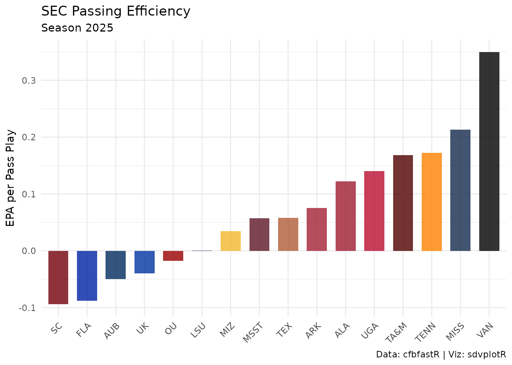
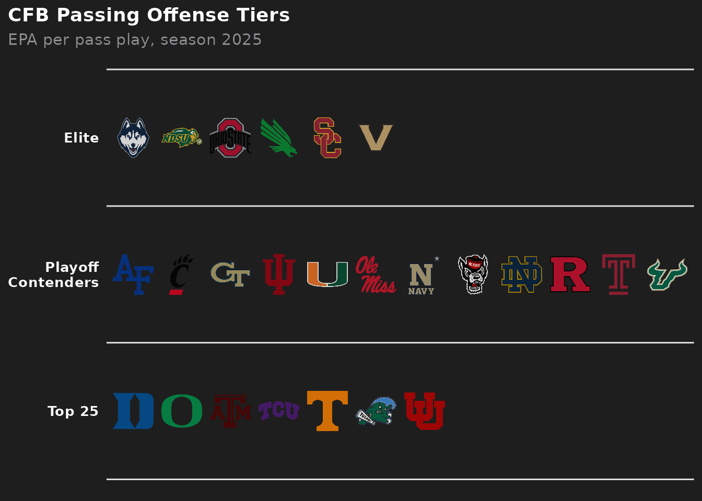
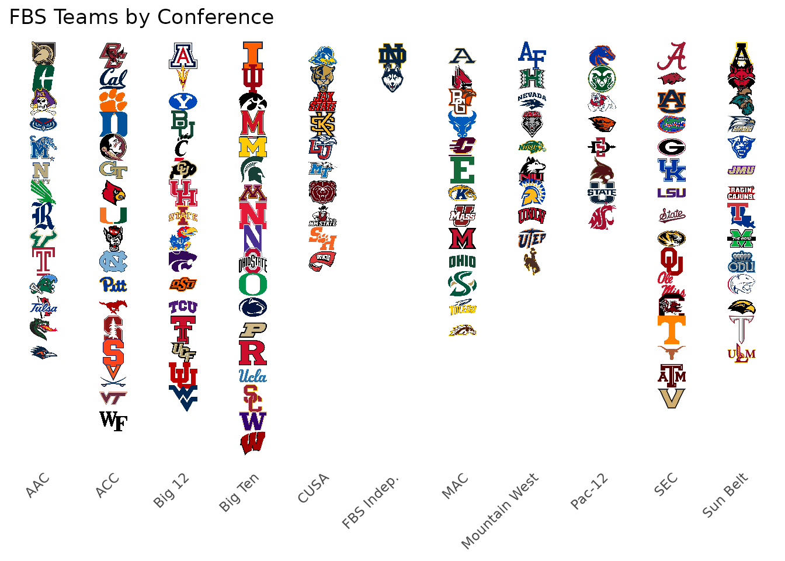
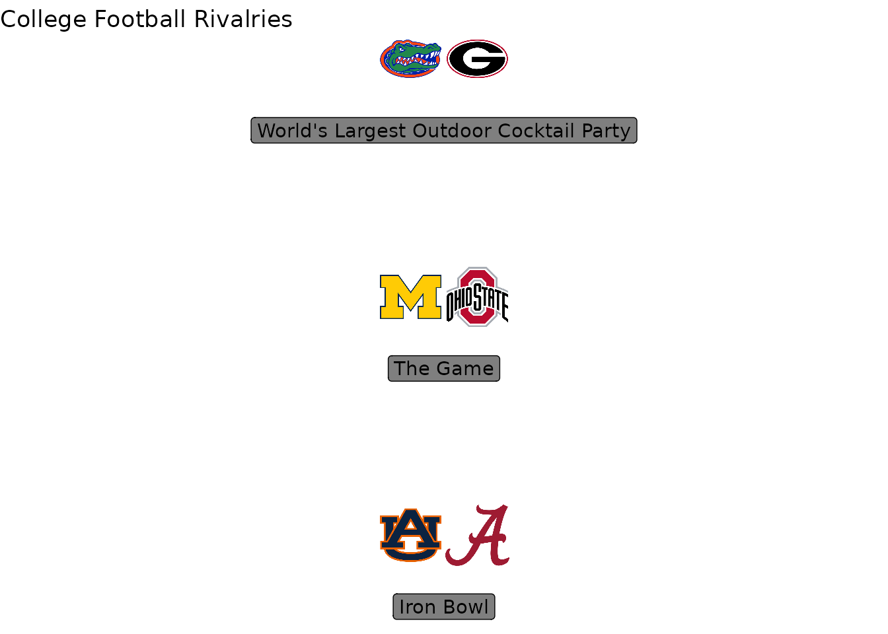
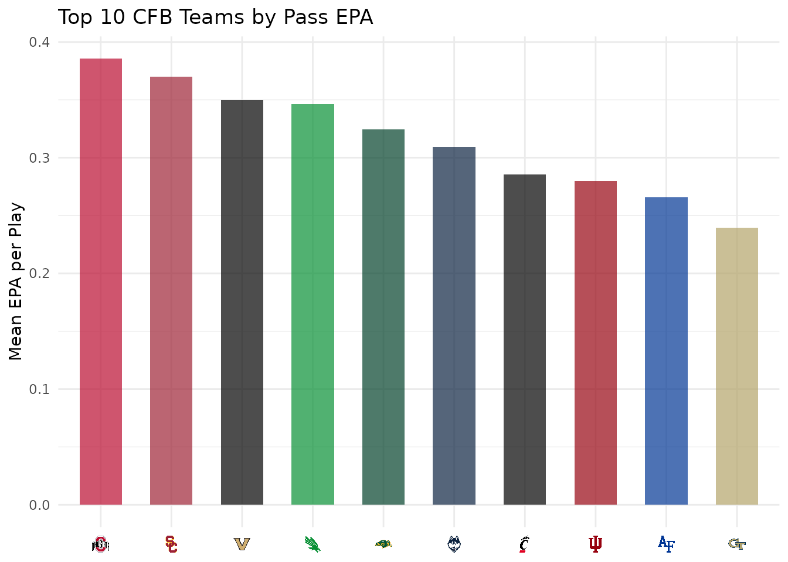

# CFB Visualizations with cfbfastR, cfbseedR, and sdvplotR

On this page

## Introduction

This vignette demonstrates how to create rich CFB (College Football)
visualizations by combining
[cfbfastR](https://cfbfastR.sportsdataverse.org) for play-by-play data,
[cfbseedR](https://cfbseedR.sportsdataverse.org) for conference
standings and College Football Playoff seeding, and
[sdvplotR](https://sdvplotr.sportsdataverse.org) for team logos, colors,
and gt tables.

## Setup

``` r

library(sdvplotR)
library(ggplot2)
library(cfbfastR)
library(cfbseedR)
library(dplyr)
library(gt)

# Get valid CFB team abbreviations
cfb_teams <- valid_team_names("cfb")
length(cfb_teams)  # every FBS and FCS program
#> [1] 267
head(cfb_teams)
#> [1] "AAMU" "ACU"  "AF"   "AKR"  "ALA"  "ALCN"
```

## Loading CFB Data

Use `cfbfastR` to load a season of play-by-play data:

``` r

# The last completed regular season (named for the year it starts; the regular
# season ends in mid-December)
season <- as.integer(format(Sys.Date(), "%Y")) -
  (format(Sys.Date(), "%m-%d") < "12-15")

pbp <- cfbfastR::load_cfb_pbp(seasons = season) |>
  filter(season_type == "regular") # drop bowl and playoff plays

# Pass plays with an EPA value; clean_team_abbrs() turns the offense's school
# name into sdvplotR's abbreviation
pass_plays <- pbp |>
  filter(pass == 1, !is.na(EPA), !is.na(pos_team)) |>
  mutate(team_abbr = clean_team_abbrs(pos_team, sport = "cfb"))
```

## Conference Standings with Logos

Rank one conference’s passing offenses by EPA per play:

``` r

# EPA per pass play for every team, with the conference sdvplotR keeps for it
team_perf <- pass_plays |>
  group_by(team_abbr) |>
  summarise(
    mean_epa = mean(EPA, na.rm = TRUE),
    n_plays = n(),
    .groups = "drop"
  ) |>
  filter(n_plays >= 100) |>
  inner_join(
    select(team_reference("cfb"), team_abbr, team_location, conference, division),
    by = "team_abbr"
  ) |>
  filter(division == "FBS")

sec_teams <- team_perf |>
  filter(conference == "SEC") |>
  arrange(desc(mean_epa))

ggplot(sec_teams, aes(x = reorder(team_abbr, mean_epa), y = mean_epa)) +
  geom_col(aes(fill = team_abbr), width = 0.7) +
  scale_fill_sdv(sport = "cfb", alpha = 0.8) +
  labs(
    title = "SEC Passing Efficiency",
    subtitle = paste("Season", season),
    x = NULL,
    y = "EPA per Pass Play",
    caption = "Data: cfbfastR | Viz: sdvplotR"
  ) +
  theme_minimal() +
  theme(
    axis.text.x = element_text(angle = 45, hjust = 1),
    legend.position = "none"
  )
```



## Playoff Bracket with cfbseedR

`cfbseedR` applies each conference’s tiebreakers and seeds a 12-team
College Football Playoff from a season’s results.

Unlike
[`load_cfb_pbp()`](https://cfbfastR.sportsdataverse.org/reference/load_cfb_pbp.html),
[`cfbfastR::load_cfb_schedules()`](https://cfbfastR.sportsdataverse.org/reference/load_cfb_schedules.html)
reads the CollegeFootballData.com API, which needs a free API key. Get
one at <https://collegefootballdata.com/key> and register it for the
session before running this chunk:

``` r

Sys.setenv(CFBD_API_KEY = "YOUR-API-KEY-HERE")
# to keep it across sessions, add CFBD_API_KEY=YOUR-API-KEY-HERE to
# ~/.Renviron (usethis::edit_r_environ()); see ?cfbfastR::register_cfbd
```

``` r

sched <- cfbfastR::load_cfb_schedules(season)

# FBS and FCS teams: games against FCS count toward records, but only FBS
# teams are seeded
teams <- bind_rows(
  sched |> transmute(team = home_team, conference = home_conference, division = toupper(home_division)),
  sched |> transmute(team = away_team, conference = away_conference, division = toupper(away_division))
) |>
  distinct(team, .keep_all = TRUE) |>
  filter(division %in% c("FBS", "FCS"))

games <- cfbseedR::cfb_games_from_schedule(sched) |>
  filter(
    game_type != "POST", !is.na(result),
    home_team %in% teams$team, away_team %in% teams$team
  )

standings <- cfbseedR::cfb_standings(games, teams, verbosity = "NONE")

bracket_data <- standings |>
  filter(team %in% teams$team[teams$division == "FBS"]) |>
  # the auto-bid rule in force that season
  cfbseedR::cfb_playoff_seeds(playoff_seeds = 12, autobid = if (season >= 2026) "2026" else "2025") |>
  filter(!is.na(seed)) |>
  mutate(team_abbr = clean_team_abbrs(team, sport = "cfb"))

ggplot(bracket_data, aes(x = seed, y = 1)) +
  geom_sdv_logos(
    aes(team = team_abbr),
    sport = "cfb",
    width = 0.07
  ) +
  scale_x_continuous(breaks = 1:12) +
  labs(
    title = "College Football Playoff Seeds",
    subtitle = paste("Season", season, "from results alone"),
    x = "Seed",
    y = NULL
  ) +
  theme_minimal() +
  theme(
    axis.text.y = element_blank(),
    panel.grid.major.y = element_blank(),
    panel.grid.minor = element_blank()
  )
```


`autobid` picks the automatic-bid rule in force that season. Without
committee rankings the field is seeded from results alone; pass the
committee’s final rankings as `rankings =` to
[`cfb_playoff_seeds()`](https://cfbseedR.sportsdataverse.org/reference/cfb_playoff_seeds.html)
to seed the bracket the way the committee did.

## CFB Team Tiers

Create a tier plot for top CFB teams:

``` r

# The 25 best passing offenses by EPA per play, in tiers
top_25 <- team_perf |>
  slice_max(mean_epa, n = 25, with_ties = FALSE) |>
  mutate(
    tier_no = case_when(
      mean_epa > 0.3 ~ 1,
      mean_epa > 0.2 ~ 2,
      mean_epa > 0.1 ~ 3,
      mean_epa > 0.0 ~ 4,
      TRUE ~ 5
    )
  ) |>
  select(tier_no, team = team_abbr)

sdv_team_tiers(
  top_25,
  sport = "cfb",
  title = "CFB Passing Offense Tiers",
  subtitle = paste("EPA per pass play, season", season),
  tier_desc = c(
    "1" = "Elite",
    "2" = "Playoff Contenders",
    "3" = "Top 25",
    "4" = "Bowl Teams",
    "5" = "Rebuilding"
  ),
  presort = TRUE
)
```



## Conference Map

Visualize all FBS teams by conference:

``` r

# FBS conferences, from the conferences sdvplotR keeps for every team
conference_map <- team_reference("cfb") |>
  filter(division == "FBS") |>
  arrange(conference, team_location) |>
  group_by(conference) |>
  mutate(team_rank = row_number()) |>
  ungroup() |>
  mutate(conference_num = as.numeric(factor(conference)))

ggplot(conference_map, aes(x = conference_num, y = team_rank)) +
  geom_sdv_logos(
    aes(team = team_abbr),
    sport = "cfb",
    width = 0.04
  ) +
  scale_x_continuous(
    breaks = seq_along(levels(factor(conference_map$conference))),
    labels = levels(factor(conference_map$conference))
  ) +
  scale_y_reverse() +
  labs(
    title = "FBS Teams by Conference",
    x = NULL,
    y = NULL
  ) +
  theme_minimal() +
  theme(
    axis.text.x = element_text(angle = 45, hjust = 1),
    axis.text.y = element_blank(),
    panel.grid = element_blank()
  )
```



## CFB Standings Table with Logos

Create a gt table with team logos:

``` r

team_perf |>
  slice_max(mean_epa, n = 15, with_ties = FALSE) |>
  mutate(rank = row_number(), logo = team_abbr) |>
  select(rank, logo, team_location, conference, mean_epa, n_plays) |>
  gt() |>
  gt_sdv_logos(columns = "logo", sport = "cfb", height = 30) |>
  fmt_number(columns = "mean_epa", decimals = 3) |>
  fmt_number(columns = "n_plays", decimals = 0) |>
  cols_label(
    rank = "#",
    logo = "",
    team_location = "Team",
    conference = "Conf",
    mean_epa = "EPA/Play",
    n_plays = "Plays"
  ) |>
  tab_header(
    title = "Top 15 CFB Passing Offenses",
    subtitle = paste("Season", season)
  )
```

| Top 15 CFB Passing Offenses |  |  |  |  |  |
|----|----|----|----|----|----|
| Season 2025 |  |  |  |  |  |
| \# |  | Team | Conf | EPA/Play | Plays |
| 1 |  | Ohio State | Big Ten | 0.386 | 384 |
| 2 |  | USC | Big Ten | 0.370 | 396 |
| 3 |  | Vanderbilt | SEC | 0.350 | 376 |
| 4 |  | North Texas | AAC | 0.346 | 450 |
| 5 |  | North Dakota State | Mountain West | 0.324 | 310 |
| 6 |  | UConn | FBS Indep. | 0.310 | 442 |
| 7 |  | Cincinnati | Big 12 | 0.285 | 353 |
| 8 |  | Indiana | Big Ten | 0.280 | 361 |
| 9 |  | Air Force | Mountain West | 0.266 | 179 |
| 10 |  | Georgia Tech | ACC | 0.239 | 360 |
| 11 |  | Temple | AAC | 0.224 | 341 |
| 12 |  | Miami | ACC | 0.223 | 388 |
| 13 |  | South Florida | AAC | 0.214 | 383 |
| 14 |  | Ole Miss | SEC | 0.214 | 419 |
| 15 |  | Rutgers | Big Ten | 0.213 | 429 |

## Rivalry Matchups

Visualize rivalry games with both team logos:

``` r

# Define rivalries
rivalries <- data.frame(
  team1 = c("ALA", "AUB", "OSU", "MICH", "UGA", "FLA"),
  team2 = c("AUB", "ALA", "MICH", "OSU", "FLA", "UGA"),
  rivalry = c("Iron Bowl", "Iron Bowl", "The Game", "The Game",
              "World's Largest Outdoor Cocktail Party",
              "World's Largest Outdoor Cocktail Party")
) |>
  distinct(rivalry, .keep_all = TRUE) |>
  mutate(row = row_number())

ggplot(rivalries, aes(x = 1, y = row)) +
  geom_sdv_logos(
    aes(team = team1),
    sport = "cfb",
    width = 0.075,
    hjust = 0
  ) +
  geom_sdv_logos(
    aes(team = team2),
    sport = "cfb",
    width = 0.075,
    hjust = 1
  ) +
  geom_label(
    aes(label = rivalry),
    nudge_y = -0.3,
    alpha = 0.5
  ) +
  scale_x_continuous(limits = c(0.5, 1.5)) +
  labs(
    title = "College Football Rivalries",
    x = NULL,
    y = NULL
  ) +
  theme_void()
```



## Axis Labels with Logos

Replace axis labels with team logos:

``` r

top_10 <- team_perf |>
  slice_max(mean_epa, n = 10, with_ties = FALSE) |>
  mutate(team_abbr = factor(team_abbr, levels = team_abbr))

ggplot(top_10, aes(x = team_abbr, y = mean_epa)) +
  geom_col(aes(fill = team_abbr), width = 0.6) +
  scale_fill_sdv(sport = "cfb", alpha = 0.7) +
  scale_x_sdv(sport = "cfb") +
  theme_minimal() +
  theme_x_sdv() +
  labs(
    title = "Top 10 CFB Teams by Pass EPA",
    x = NULL,
    y = "Mean EPA per Play"
  ) +
  theme(legend.position = "none")
```



## Next Steps

- Explore [cfbfastR
  documentation](https://cfbfastR.sportsdataverse.org/)
- Try [cfbseedR](https://cfbseedR.sportsdataverse.org) for tournament
  simulations
- Combine with [oddsapiR](https://oddsapiR.sportsdataverse.org) for
  betting lines

## Related Vignettes

- [Getting
  Started](https://sdvplotR.sportsdataverse.org/articles/getting-started.md)
- [Social Posting
  Patterns](https://sdvplotR.sportsdataverse.org/articles/social-posting.md)
- [Leaderboard
  Dashboards](https://sdvplotR.sportsdataverse.org/articles/leaderboard-dashboards.md)
