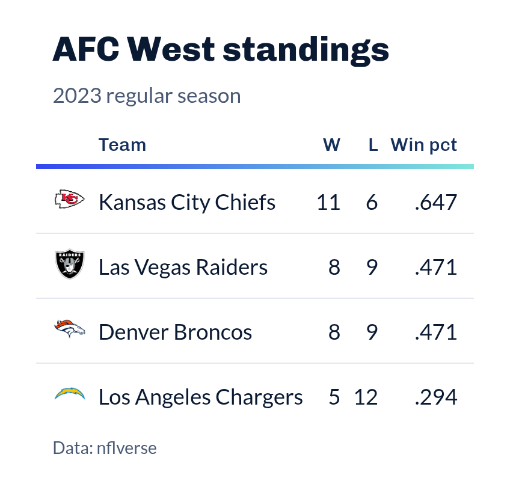

# Gallery

On this page

Each picture links to its article. A plot is the figure that article
draws when this site is built; an article built on tables shows a
preview of a table theme from the package.

[Getting
Started](https://sdvplotR.sportsdataverse.org/articles/getting-started.md)
[NFL](https://sdvplotR.sportsdataverse.org/articles/nfl-viz.md)
[College
Football](https://sdvplotR.sportsdataverse.org/articles/cfb-viz.md)
[NBA](https://sdvplotR.sportsdataverse.org/articles/nba-viz.md)
[WNBA](https://sdvplotR.sportsdataverse.org/articles/wnba-viz.md)
[MLB](https://sdvplotR.sportsdataverse.org/articles/mlb-viz.md)
[NHL](https://sdvplotR.sportsdataverse.org/articles/nhl-viz.md)
[Men's
College
Basketball](https://sdvplotR.sportsdataverse.org/articles/mbb-viz.md)
[Women's
College
Basketball](https://sdvplotR.sportsdataverse.org/articles/wbb-viz.md)
[Social
Posting](https://sdvplotR.sportsdataverse.org/articles/social-posting.md)
[Leaderboard
Dashboards](https://sdvplotR.sportsdataverse.org/articles/leaderboard-dashboards.md)
[reactable
Integration](https://sdvplotR.sportsdataverse.org/articles/reactable-integration.md)
[End-to-End
Workflows](https://sdvplotR.sportsdataverse.org/articles/workflows.md)
[SportsDataverse Table
Themes](https://sdvplotR.sportsdataverse.org/articles/sdv-table-themes.md)
[Team
Tables with the gt
Toolkit](https://sdvplotR.sportsdataverse.org/articles/gt-toolkit.md)
[Styling Headers,
Legends and
Captions](https://sdvplotR.sportsdataverse.org/articles/styling.md)
[Saving and Posting
Tables](https://sdvplotR.sportsdataverse.org/articles/saving_tables.md)
[Border
Bars](https://sdvplotR.sportsdataverse.org/articles/border_bars.md)
[Percentile Bars and
Cut
Lines](https://sdvplotR.sportsdataverse.org/articles/delay_tables.md)
[Faceted
Tables](https://sdvplotR.sportsdataverse.org/articles/grid_tables.md)
[Schedule
Matrix](https://sdvplotR.sportsdataverse.org/articles/schedule_matrix.md)
[Tier
Lists](https://sdvplotR.sportsdataverse.org/articles/tier_list.md)
[Rolling-Window
Wins](https://sdvplotR.sportsdataverse.org/articles/window_wins.md)
[Neighbour
Ranks](https://sdvplotR.sportsdataverse.org/articles/neighbour-ranks.md)
[Shot
Grid](https://sdvplotR.sportsdataverse.org/articles/shot-grid.md)
[Rolling
Form](https://sdvplotR.sportsdataverse.org/articles/rolling-form.md)
[Signature
Ribbon](https://sdvplotR.sportsdataverse.org/articles/signature-ribbon.md)
