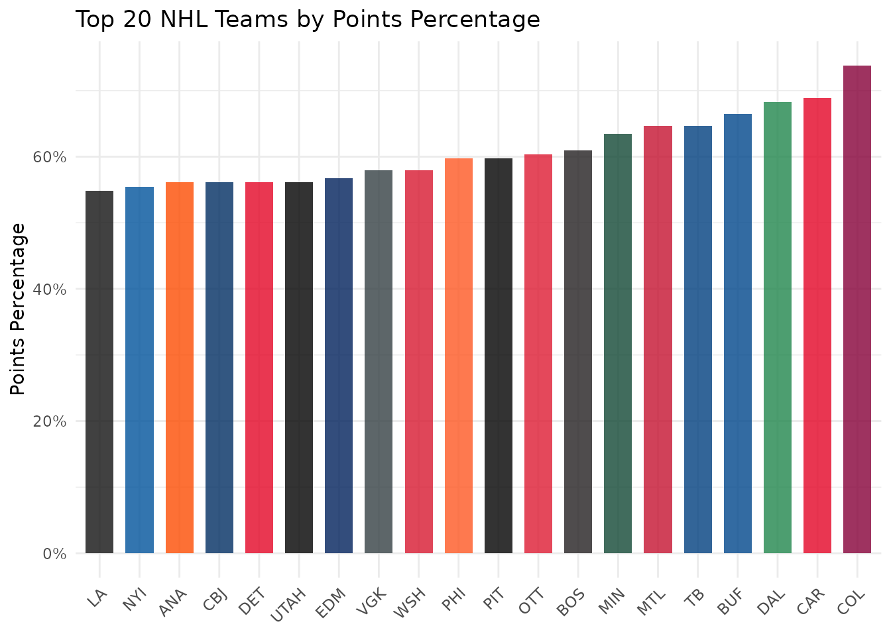
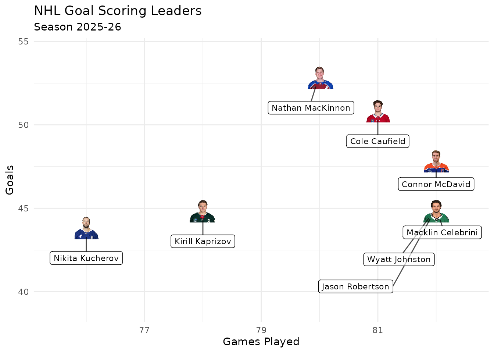
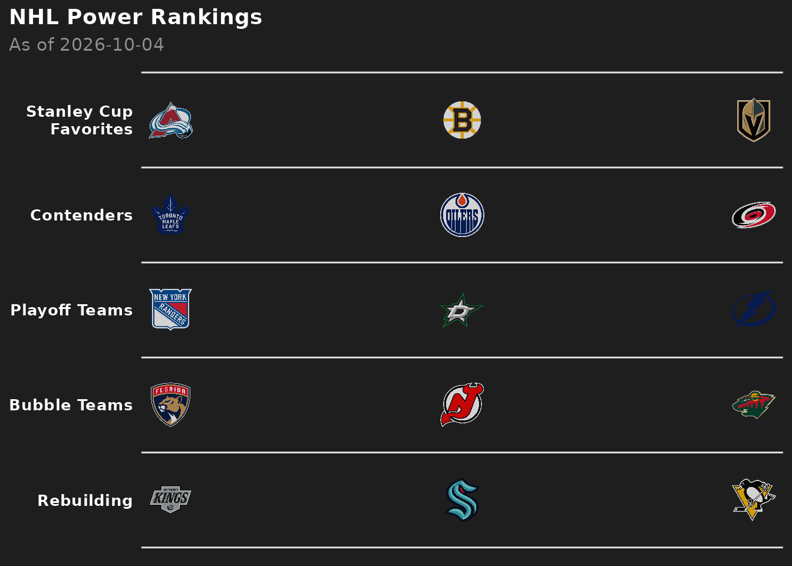
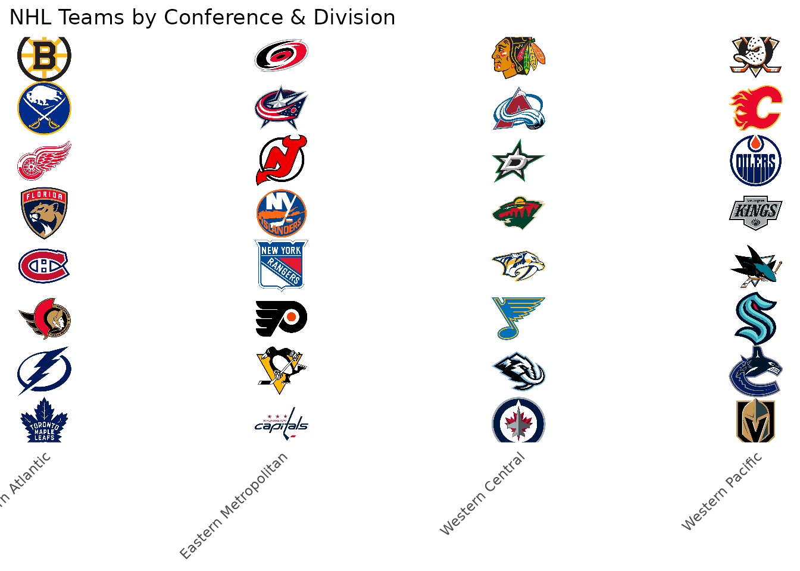
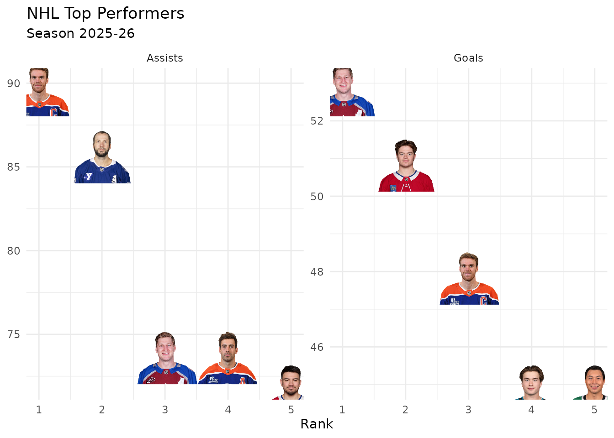
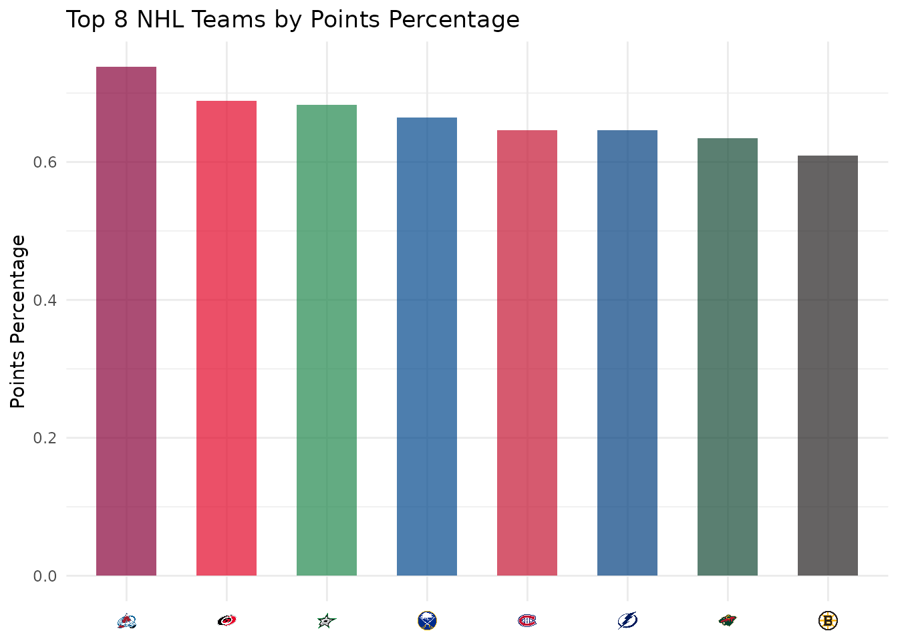

# NHL Visualizations with fastRhockey and sdvplotR

On this page

## Introduction

This vignette demonstrates how to create rich NHL visualizations by
combining [fastRhockey](https://fastRhockey.sportsdataverse.org) for
player and team data with
[sdvplotR](https://sdvplotr.sportsdataverse.org) for team logos,
headshots, colors, and gt tables.

## Setup

``` r

library(sdvplotR)
library(ggplot2)
library(fastRhockey)
library(dplyr)
library(gt)

# Get valid NHL team abbreviations
nhl_teams <- valid_team_names("nhl")
head(nhl_teams)
#> [1] "ANA" "BOS" "BUF" "CAR" "CBJ" "CGY"
```

## Loading NHL Data

Use `fastRhockey` to load team and skater statistics from the NHL Stats
API:

``` r

# The last completed regular season (fastRhockey names a season for the year
# it ends; the regular season ends in mid-April)
season <- as.integer(format(Sys.Date(), "%Y")) -
  (format(Sys.Date(), "%m-%d") < "04-20")
season_id <- paste0(season - 1, season)

# One row per team; clean_team_abbrs() turns the NHL's full names into
# sdvplotR's abbreviations
team_stats <- fastRhockey::nhl_stats_teams(season = season_id) |>
  mutate(team_abbr = clean_team_abbrs(team_full_name, sport = "nhl"))

# Every skater (limit = -1), keyed by NHL API player ID, so the goal and assist
# leaderboards below rank the full list
player_stats <- fastRhockey::nhl_stats_skaters(season = season_id, limit = -1)
```

The output below uses a snapshot of these calls taken on October 04,
2026 (fastRhockey 1.0.0), because the NHL Stats API is not called when
this site is built.

## NHL Team Performance

Plot every team’s goals for against goals against, with team logos:

``` r

ggplot(team_stats, aes(x = goals_for_per_game, y = goals_against_per_game)) +
  geom_sdv_logos(
    aes(team = team_abbr),
    sport = "nhl",
    width = 0.06
  ) +
  scale_y_reverse() +
  labs(
    title = "NHL Goals For and Against",
    subtitle = paste0("Season ", season - 1, "-", substr(season, 3, 4)),
    x = "Goals For per Game",
    y = "Goals Against per Game (fewer is better)",
    caption = "Data: fastRhockey | Viz: sdvplotR"
  ) +
  theme_minimal()
```


## NHL Team Colors

Use team colors to show points percentage:

``` r

team_wins <- team_stats |>
  arrange(desc(point_pct)) |>
  head(20)

ggplot(team_wins, aes(x = reorder(team_abbr, point_pct), y = point_pct)) +
  geom_col(aes(fill = team_abbr), width = 0.7) +
  scale_fill_sdv(sport = "nhl", alpha = 0.8) +
  scale_y_continuous(labels = scales::percent) +
  labs(
    title = "Top 20 NHL Teams by Points Percentage",
    x = NULL,
    y = "Points Percentage"
  ) +
  theme_minimal() +
  theme(
    axis.text.x = element_text(angle = 45, hjust = 1),
    legend.position = "none"
  )
```



## Player Headshots

Plot the goal scoring leaders with their headshots:

``` r

top_goals <- player_stats |>
  slice_max(goals, n = 8, with_ties = FALSE)

ggplot(top_goals, aes(x = games_played, y = goals)) +
  geom_sdv_headshots(
    aes(player_id = player_id),
    sport = "nhl",
    id_type = "league",
    height = 0.1
  ) +
  # Labels sit a fixed share of the y range below their face; ggrepel moves
  # the ones that would collide and draws a connector back to the player
  ggrepel::geom_label_repel(
    aes(label = skater_full_name),
    nudge_y = -0.22 * diff(range(top_goals$goals)),
    size = 3,
    alpha = 0.7,
    box.padding = 0.5,
    point.size = 12,
    min.segment.length = 0,
    seed = 1
  ) +
  scale_x_continuous(expand = expansion(mult = 0.15)) +
  scale_y_continuous(expand = expansion(mult = c(0.35, 0.2))) +
  labs(
    title = "NHL Goal Scoring Leaders",
    subtitle = paste0("Season ", season - 1, "-", substr(season, 3, 4)),
    x = "Games Played",
    y = "Goals"
  ) +
  theme_minimal()
```



### NHL API player IDs

The NHL’s own APIs, which fastRhockey’s `nhl_*()` functions and its
`load_nhl_*()` datasets come from, identify players by their NHL API ID
(McDavid is 8478402), not their ESPN athlete ID, which is why these
headshots pass `id_type = "league"`: it draws NHL API IDs from the NHL’s
image CDN. Leave `id_type` unset for ESPN athlete IDs, such as those in
fastRhockey’s `espn_nhl_*()` data. Both are plain numbers, so the wrong
setting draws someone else or nothing.

## NHL Team Tiers

Create a tier plot ranking NHL teams:

``` r

# Sample tier assignments
tier_data <- data.frame(
  tier_no = c(1, 1, 1, 2, 2, 2, 3, 3, 3, 4, 4, 4, 5, 5, 5),
  team = c("COL", "BOS", "VGK", "TOR", "EDM", "CAR",
           "NYR", "DAL", "TB",
           "FLA", "NJ", "MIN",
           "LA", "SEA", "PIT")
)

sdv_team_tiers(
  tier_data,
  sport = "nhl",
  title = "NHL Power Rankings",
  subtitle = paste("As of", Sys.Date()),
  tier_desc = c(
    "1" = "Stanley Cup Favorites",
    "2" = "Contenders",
    "3" = "Playoff Teams",
    "4" = "Bubble Teams",
    "5" = "Rebuilding"
  )
)
```



## NHL Conference Map

Show each division’s teams in a column, using the conference and
division sdvplotR keeps for every team:

``` r

conference_map <- team_reference("nhl") |>
  mutate(conf_div = paste(conference, division)) |>
  arrange(conf_div, team_name) |>
  group_by(conf_div) |>
  mutate(team_rank = row_number()) |>
  ungroup() |>
  mutate(conf_div_num = as.numeric(factor(conf_div)))

ggplot(conference_map, aes(x = conf_div_num, y = team_rank)) +
  geom_sdv_logos(
    aes(team = team_abbr),
    sport = "nhl",
    width = 0.075
  ) +
  scale_x_continuous(
    breaks = seq_along(levels(factor(conference_map$conf_div))),
    labels = levels(factor(conference_map$conf_div))
  ) +
  scale_y_reverse() +
  labs(
    title = "NHL Teams by Conference & Division",
    x = NULL,
    y = NULL
  ) +
  theme_minimal() +
  theme(
    axis.text.x = element_text(angle = 45, hjust = 1),
    axis.text.y = element_blank(),
    panel.grid = element_blank()
  )
```



## NHL Standings Table with Logos

Create a gt table with team logos:

``` r

team_wins |>
  head(15) |>
  mutate(rank = row_number(), logo = team_abbr) |>
  select(rank, logo, team_full_name, wins, losses, ot_losses, points, point_pct) |>
  gt() |>
  gt_sdv_logos(columns = "logo", sport = "nhl", height = 35) |>
  fmt_number(columns = "point_pct", decimals = 3) |>
  cols_label(
    rank = "#",
    logo = "",
    team_full_name = "Team",
    wins = "W",
    losses = "L",
    ot_losses = "OTL",
    points = "Pts",
    point_pct = "Pts%"
  ) |>
  tab_header(
    title = "NHL Top 15",
    subtitle = paste0("Season ", season - 1, "-", substr(season, 3, 4))
  )
```

| NHL Top 15 |  |  |  |  |  |  |  |
|----|----|----|----|----|----|----|----|
| Season 2025-26 |  |  |  |  |  |  |  |
| \# |  | Team | W | L | OTL | Pts | Pts% |
| 1 |  | Colorado Avalanche | 55 | 16 | 11 | 121 | 0.738 |
| 2 |  | Carolina Hurricanes | 53 | 22 | 7 | 113 | 0.689 |
| 3 |  | Dallas Stars | 50 | 20 | 12 | 112 | 0.683 |
| 4 |  | Buffalo Sabres | 50 | 23 | 9 | 109 | 0.665 |
| 5 |  | Montréal Canadiens | 48 | 24 | 10 | 106 | 0.646 |
| 6 |  | Tampa Bay Lightning | 50 | 26 | 6 | 106 | 0.646 |
| 7 |  | Minnesota Wild | 46 | 24 | 12 | 104 | 0.634 |
| 8 |  | Boston Bruins | 45 | 27 | 10 | 100 | 0.610 |
| 9 |  | Ottawa Senators | 44 | 27 | 11 | 99 | 0.604 |
| 10 |  | Pittsburgh Penguins | 41 | 25 | 16 | 98 | 0.598 |
| 11 |  | Philadelphia Flyers | 43 | 27 | 12 | 98 | 0.598 |
| 12 |  | Washington Capitals | 43 | 30 | 9 | 95 | 0.579 |
| 13 |  | Vegas Golden Knights | 39 | 26 | 17 | 95 | 0.579 |
| 14 |  | Edmonton Oilers | 41 | 30 | 11 | 93 | 0.567 |
| 15 |  | Utah Mammoth | 43 | 33 | 6 | 92 | 0.561 |

## Player Performance Comparison

Compare the goal scoring leaders with the assist leaders:

``` r

comparison <- bind_rows(
  player_stats |>
    slice_max(goals, n = 5, with_ties = FALSE) |>
    transmute(player_id, category = "Goals", value = goals),
  player_stats |>
    slice_max(assists, n = 5, with_ties = FALSE) |>
    transmute(player_id, category = "Assists", value = assists)
) |>
  group_by(category) |>
  mutate(rank = row_number()) |>
  ungroup()

ggplot(comparison, aes(x = rank, y = value)) +
  geom_sdv_headshots(
    aes(player_id = player_id),
    sport = "nhl",
    id_type = "league",
    height = 0.2
  ) +
  facet_wrap(~category, scales = "free_y") +
  scale_x_continuous(breaks = 1:5) +
  labs(
    title = "NHL Top Performers",
    subtitle = paste0("Season ", season - 1, "-", substr(season, 3, 4)),
    x = "Rank",
    y = NULL
  ) +
  theme_minimal()
```



## Axis Labels with Logos

Replace axis labels with team logos
([`theme_x_sdv()`](https://sdvplotR.sportsdataverse.org/reference/theme_sdv.md)
needs the `ggtext` package, and goes after any complete theme such as
[`theme_minimal()`](https://ggplot2.tidyverse.org/reference/ggtheme.html)):

``` r

top_8 <- team_wins |>
  head(8) |>
  mutate(team_abbr = factor(team_abbr, levels = team_abbr))

ggplot(top_8, aes(x = team_abbr, y = point_pct)) +
  geom_col(aes(fill = team_abbr), width = 0.6) +
  scale_fill_sdv(sport = "nhl", alpha = 0.7) +
  scale_x_sdv(sport = "nhl") +
  theme_minimal() +
  theme_x_sdv() +
  labs(
    title = "Top 8 NHL Teams by Points Percentage",
    x = NULL,
    y = "Points Percentage"
  ) +
  theme(legend.position = "none")
```



## Next Steps

- Explore [fastRhockey
  documentation](https://fastRhockey.sportsdataverse.org/)
- Try combining with [oddsapiR](https://oddsapiR.sportsdataverse.org)
  for betting lines
- Build weekly dashboard with [Quarto](https://quarto.org/)

## Related Vignettes

- [Getting
  Started](https://sdvplotR.sportsdataverse.org/articles/getting-started.md)
- [Social Posting
  Patterns](https://sdvplotR.sportsdataverse.org/articles/social-posting.md)
- [Leaderboard
  Dashboards](https://sdvplotR.sportsdataverse.org/articles/leaderboard-dashboards.md)
