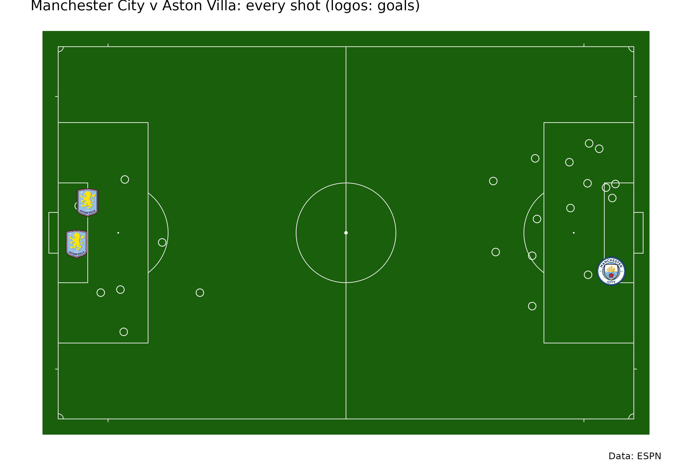
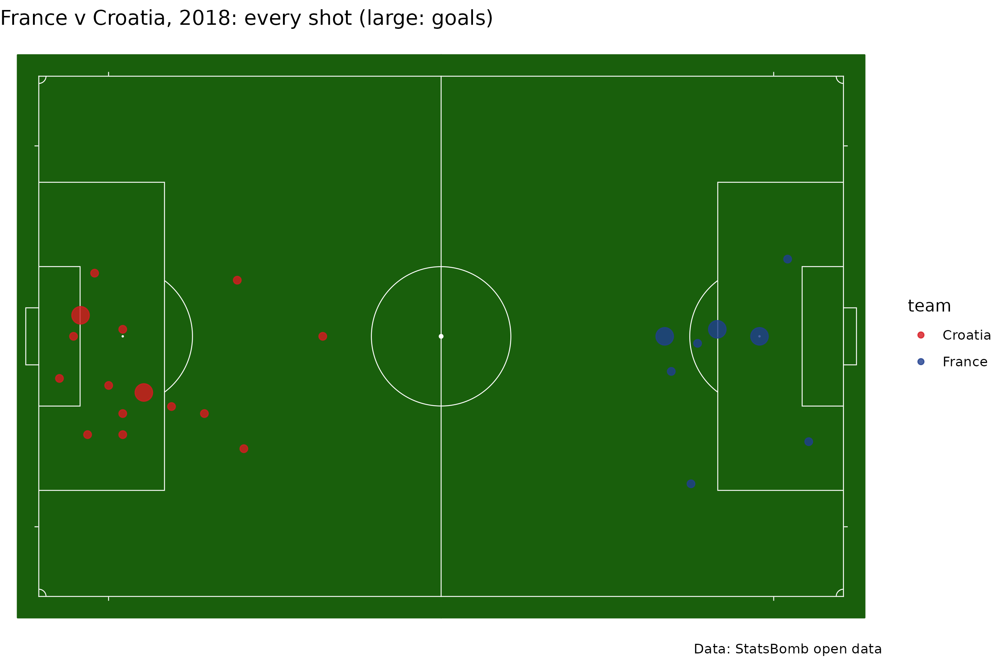
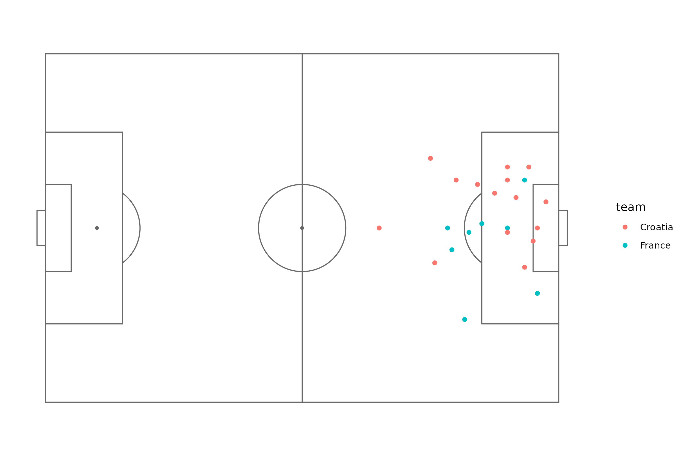
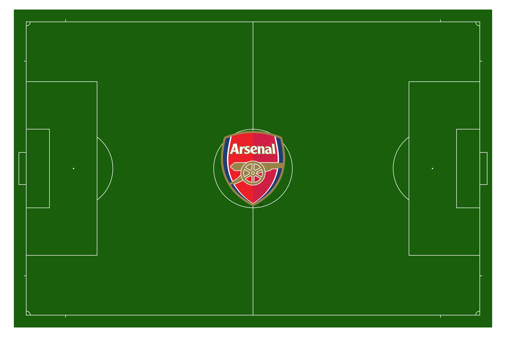

# Soccer: any provider's shots on one pitch

On this page

``` r

library(sdvplotR)
library(ggplot2)
```

[`sdv_pitch_coords()`](https://sdvplotR.sportsdataverse.org/reference/sdv_pitch_coords.md)
converts soccer event coordinates from any major provider to one frame:
meters from the center spot of a regulation 105 x 68 m pitch, attacking
toward +x, with +y on the attacker’s left. `sdv_surface("soccer")` draws
that pitch.

## ESPN: the Premier League’s final day of 2025-26

ESPN’s play-by-play (the same feed sportsdataverse-py’s
`espn_soccer_game_plays()` reads) records each shot’s distance from the
goal it attacks as a fraction of half the pitch. Manchester City (ESPN
id 382) against Aston Villa (362); the away team’s shots are flipped so
the two sides attack opposite ends.

``` r

url <- paste0(
  "https://sports.core.api.espn.com/v2/sports/soccer/leagues/eng.1/events/740970/",
  "competitions/740970/plays?limit=1000"
)
items <- jsonlite::fromJSON(url)$items
plays <- data.frame(
  type = items$type$text,
  field_position_x = items$fieldPositionX,
  field_position_y = items$fieldPositionY,
  team = sub(".*/teams/([0-9]+).*", "\\1", items$team$`$ref`),
  goal = items$scoringPlay
)
shots <- plays[grepl("shot|goal", plays$type, ignore.case = TRUE) & plays$type != "Assists Shot", ]
shots <- sdv_pitch_coords(transform(shots, away = team != "382"), "espn", flip = "away")
shots <- shots[!is.na(shots$pitch_x), ]

sdv_surface("soccer") +
  geom_point(aes(pitch_x, pitch_y), data = shots[!shots$goal, ], shape = 21, size = 3, fill = NA, color = "white") +
  geom_sdv_logos(aes(pitch_x, pitch_y, team = team), data = shots[shots$goal, ], sport = "soccer", width = 0.05) +
  labs(title = "Manchester City v Aston Villa: every shot (logos: goals)", caption = "Data: ESPN")
```



## StatsBomb: the 2018 World Cup final

The same function reads StatsBomb’s 120 x 80 frame. StatsBomb open data
is free for non-commercial use.

``` r

events <- jsonlite::fromJSON(
  "https://raw.githubusercontent.com/statsbomb/open-data/master/data/events/8658.json",
  simplifyDataFrame = FALSE
)
shots_sb <- do.call(rbind, lapply(Filter(function(e) e$type$name == "Shot", events), function(e) {
  data.frame(team = e$team$name, x = e$location[[1]], y = e$location[[2]], goal = e$shot$outcome$name == "Goal")
}))
shots_sb <- sdv_pitch_coords(transform(shots_sb, croatia = team == "Croatia"), "statsbomb", flip = "croatia")

sdv_surface("soccer") +
  geom_point(aes(pitch_x, pitch_y, color = team, size = goal), data = shots_sb, alpha = 0.8) +
  scale_color_manual(values = c(France = "#1f3f8f", Croatia = "#d71920")) +
  scale_size_manual(values = c(`FALSE` = 2, `TRUE` = 5), guide = "none") +
  labs(title = "France v Croatia, 2018: every shot (large: goals)", caption = "Data: StatsBomb open data")
```



## In the provider’s own frame, with ggsoccer

To keep a provider’s frame instead,
[ggsoccer](https://github.com/Torvaney/ggsoccer) draws its pitch;
StatsBomb’s y runs top to bottom, hence the reversed scale.

``` r

raw_sb <- shots_sb[c("team", "x", "y", "goal")]
ggplot(raw_sb, aes(x, y, color = team)) +
  ggsoccer::annotate_pitch(dimensions = ggsoccer::pitch_statsbomb) +
  geom_point() +
  scale_y_reverse() +
  ggsoccer::theme_pitch()
#> Scale for y is already present.
#> Adding another scale for y, which will replace the existing scale.
```



## Club colors and the center logo

``` r

sdv_team_colors("soccer", c("359", "382", "18418"))
#>       359       382     18418 
#> "#E20520" "#99C5EA" "#9D2235"
sdv_surface("soccer", "359", center_logo = TRUE)
```


