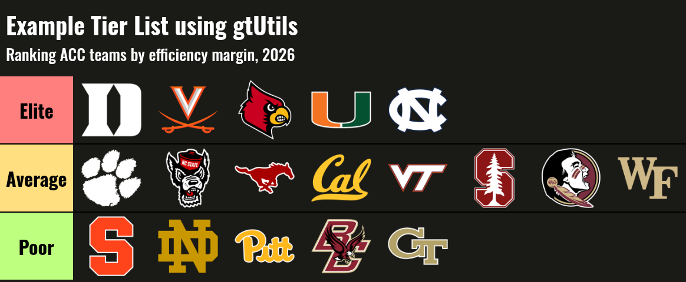

# Creating Tier Lists

On this page

``` r

library(sdvplotR)
library(gt)
library(tidyverse)
```

`sdvplotR` ships with a function that makes creating tier lists
convenient and quick. However, you need to pass your data to `gt` in a
specific format. This vignette walks through how to create a simple tier
list.



## Basic Tier List

For this example, we rank the ACC’s men’s basketball teams by efficiency
margin: points scored minus points allowed per 100 possessions, over the
last completed season, computed from
[`hoopR`](https://hoopR.sportsdataverse.org)’s ESPN box scores.

### Processing

[`team_reference()`](https://sdvplotR.sportsdataverse.org/reference/team_reference.md)
lists the ACC’s members, with their ESPN ids and logos. The box scores
hold one row per team per game; joining each row to its opponent’s row
gives the possessions and points on both sides.

``` r

# the last completed season, tournament included (hoopR names it for the
# year it ends; the Final Four is in early April)
season <- as.integer(format(Sys.Date(), "%Y")) -
  (format(Sys.Date(), "%m-%d") < "04-10")

acc <- team_reference("mbb") %>%
  filter(conference == "ACC")

# possessions estimated from the box score
box <- hoopR::load_mbb_team_box(seasons = season) %>%
  mutate(poss = field_goals_attempted - offensive_rebounds + total_turnovers + 0.475 * free_throws_attempted)

data <- box %>%
  filter(team_id %in% acc$espn_team_id) %>%
  inner_join(
    select(box, game_id, opponent_team_id = team_id, opp_poss = poss),
    by = c("game_id", "opponent_team_id")
  ) %>%
  summarise(
    eff_margin = 100 * sum(team_score - opponent_team_score) / sum((poss + opp_poss) / 2),
    .by = team_id
  ) %>%
  mutate(team = acc$team_abbr[match(team_id, acc$espn_team_id)])
```

We need to establish tiers and colors. For this example, we are going to
use three distinct categories and use traditional tier list background
colors.

``` r

levels <- c("Elite", "Average", "Poor")
colors <- c("#FF7F7F", "#FFDF7F", "#BFFF7F")
```

Next, we need to bin our data into these tiers. `subset_rank` uses the
`dense_rank` function to assign ordinal ranks based on our column of
interest – efficiency margin. Next, we use the cut function to divide
these ranks into distinct tiers based on quantiles, specifying the
breaks at the 25th and 75th percentiles. This means the data is split
into three groups, with the lower 25% in one tier, the middle 50% in
another, and the upper 25% in the final tier. The levels argument
provides custom labels for each tier – referencing the `levels` vector
above – while `include.lowest = TRUE` ensures the lowest rank is
included in the first tier.

Finally, tier_order is calculated as the rank within each tier using
`dense_rank` again, but this time grouped by the tier to ensure the
ordering is relative to each group.

``` r

data <- data %>%
  mutate(
    subset_rank = dense_rank(-eff_margin),
    tier = cut(subset_rank,
      breaks = quantile(subset_rank, probs = c(0, 0.25, 0.75, 1)),
      labels = levels,
      include.lowest = TRUE
    )
  ) %>%
  mutate(tier_order = dense_rank(subset_rank), .by = tier)
```

[`team_reference()`](https://sdvplotR.sportsdataverse.org/reference/team_reference.md)
also carries each team’s logos. We are going to use a dark table theme,
so we take the dark-mode logo, falling back to the primary one where
ESPN has no dark version.

``` r

data <- data %>%
  left_join(select(acc, team = team_abbr, logo_dark_url, logo_url), by = "team") %>%
  mutate(logo = coalesce(logo_dark_url, logo_url))
```

Finally, we need to pivot our data to a *wide* format. This ensures that
we will be plotting logos horizontally.

``` r

data <- data %>%
  pivot_wider(id_cols = tier, names_from = tier_order, values_from = logo) %>%
  select(tier, sort(names(.))) %>%
  arrange(tier)
```

Great – if your data looks similar to this, you’re ready to make a tier
list!

### Plotting

`gt_tiers` does a few things under the hood: - It renders images from
links - It applies the `gt_theme_tier` function using “dark” mode as a
default - It forces all column labels to be blank

Let’s apply it!

``` r

data %>%
  gt() %>%
  gt_tiers(levels, colors) %>%
  tab_header(
    title = "Example Tier List using gtUtils",
    subtitle = paste("Ranking ACC teams by efficiency margin,", season)
  )
```


All done! You’ve created a tier list in `gt` using `sdvplotR`. The tier
list function is somewhat limited: a) it only supports image cells and
b) it will not “wrap” your logos to condense the width (you can play
around with image_height to do this).
