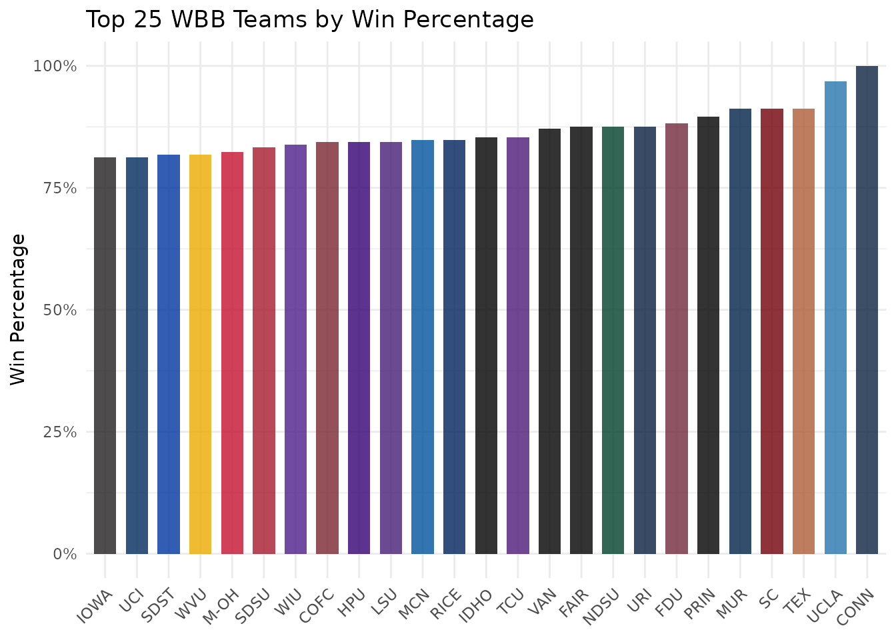
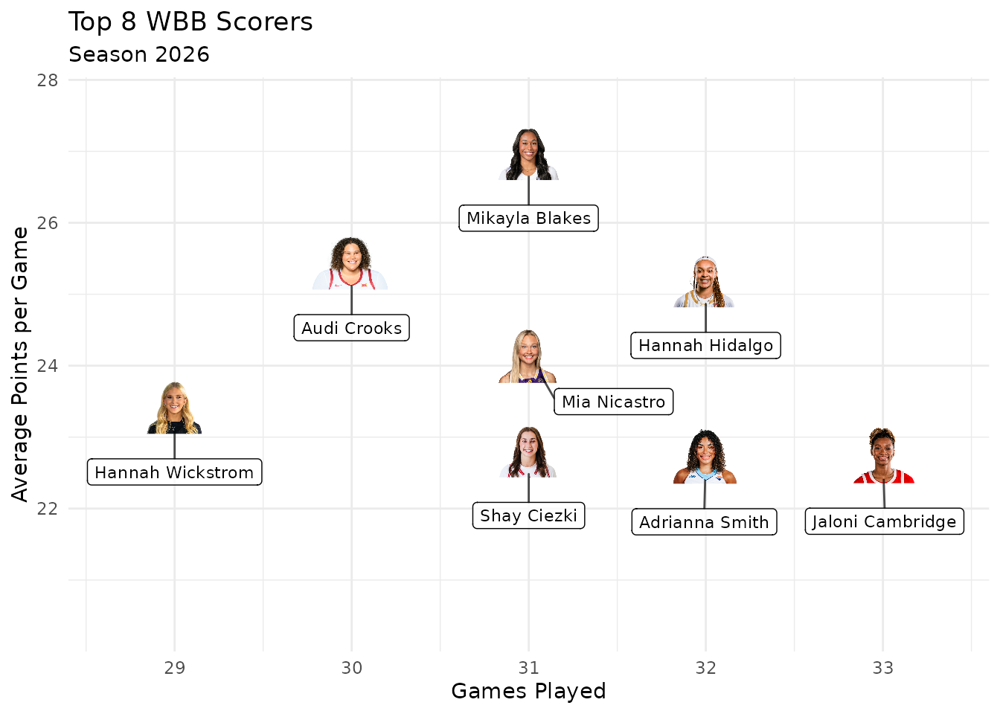
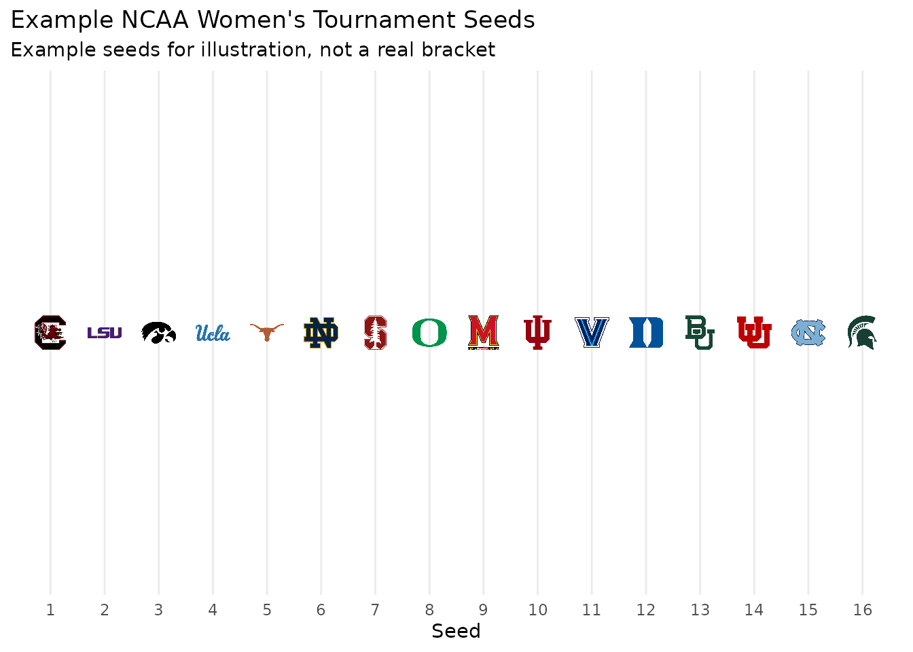
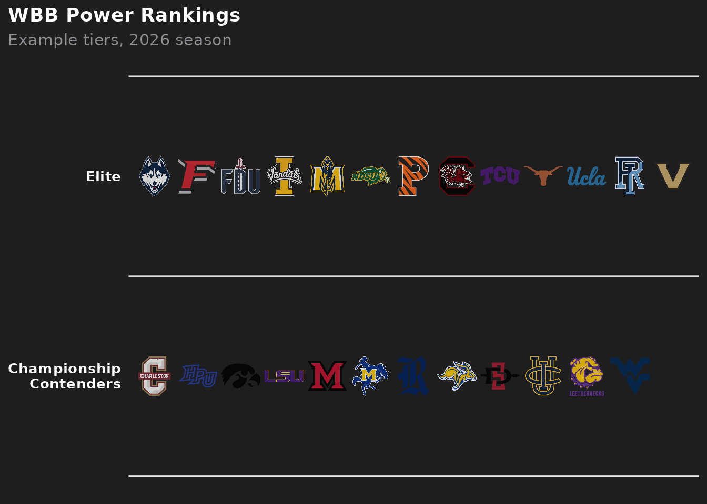
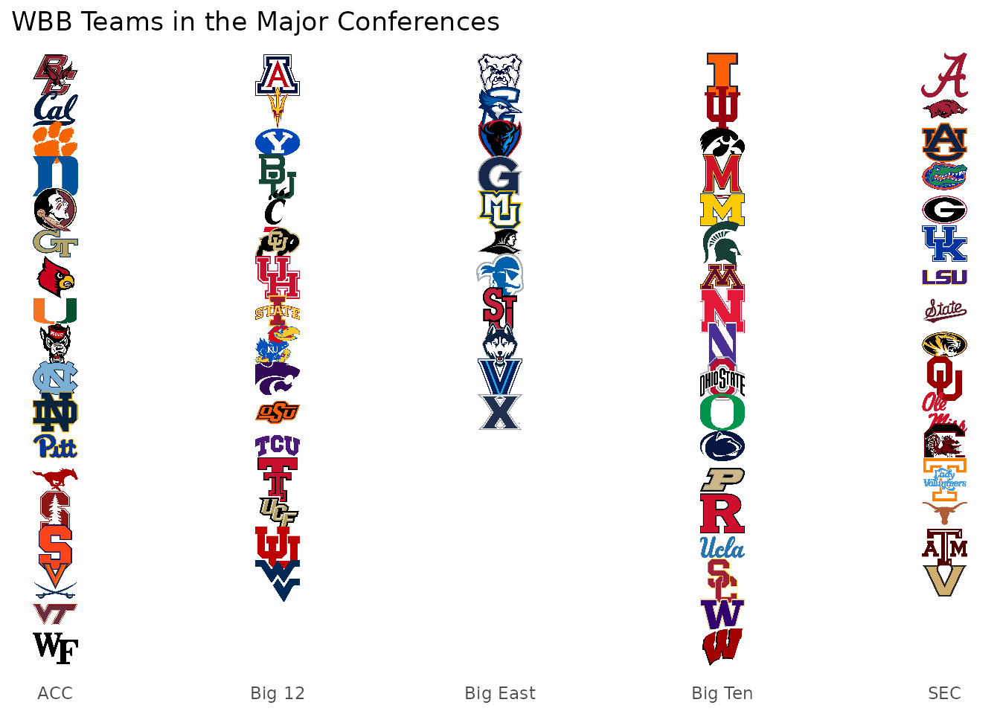
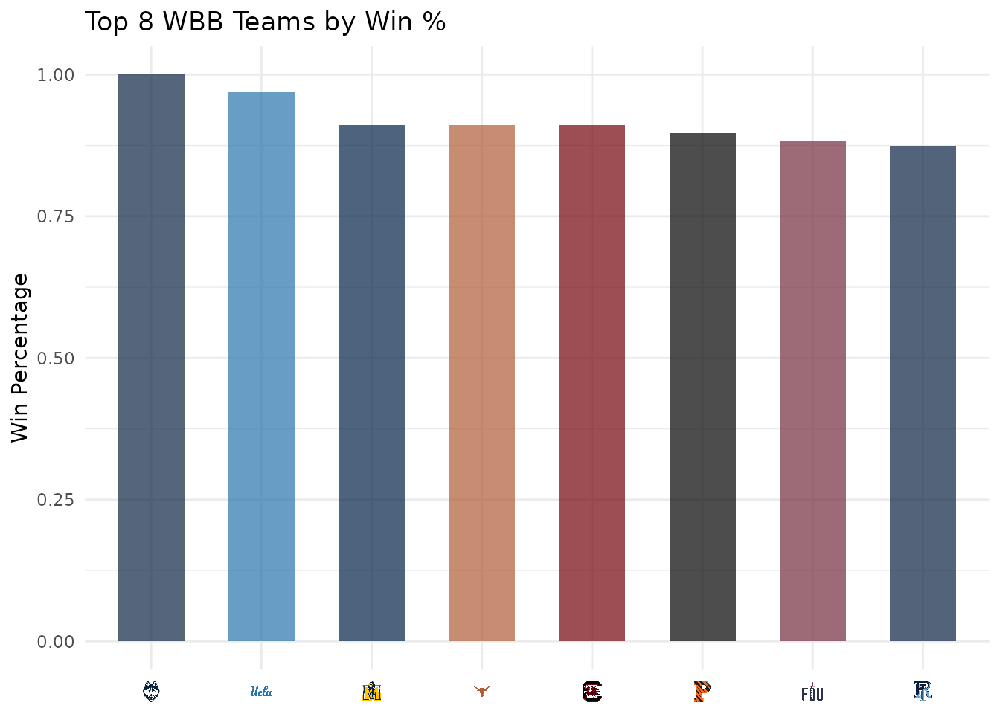

# WBB Visualizations with wehoop and sdvplotR

On this page

## Introduction

This vignette demonstrates how to create rich WBB (Women’s College
Basketball) visualizations by combining
[wehoop](https://wehoop.sportsdataverse.org) for player and team data
and [sdvplotR](https://sdvplotr.sportsdataverse.org) for team logos,
headshots, colors, and gt tables.

## Setup

``` r

library(sdvplotR)
library(ggplot2)
library(wehoop)
library(dplyr)
library(gt)

# Get valid WBB team abbreviations
wbb_teams <- valid_team_names("wbb")
length(wbb_teams)  # ~350+ D1 teams
#> [1] 364
head(wbb_teams)
#> [1] "AAMU" "ACU"  "AF"   "AKR"  "ALA"  "ALCN"
```

## Loading WBB Data

Use `wehoop` to load this season’s ESPN team and player box scores:

``` r

# The last completed regular season (wehoop names a season for the year it
# ends; the regular season ends in mid-March)
season <- as.integer(format(Sys.Date(), "%Y")) -
  (format(Sys.Date(), "%m-%d") < "03-20")

# One row per team per game (ESPN box scores), regular season only; Division I
# teams only (the box scores also hold their games against other divisions)
team_stats <- wehoop::load_wbb_team_box(seasons = season) |>
  filter(season_type == 2, team_abbreviation %in% team_reference("wbb")$team_abbr)

# One row per player per game, with ESPN athlete IDs; players who did not
# play are dropped so games played counts real games
player_stats <- wehoop::load_wbb_player_box(seasons = season) |>
  filter(season_type == 2, !did_not_play)
```

## WBB Team Performance

Visualize team performance with team logos:

``` r

# Calculate team metrics
team_perf <- team_stats |>
  filter(!is.na(team_abbreviation)) |>
  group_by(team_id, team_abbreviation) |>
  summarise(
    avg_points = mean(team_score, na.rm = TRUE),
    avg_rebounds = mean(total_rebounds, na.rm = TRUE),
    games = n(),
    .groups = "drop"
  ) |>
  filter(games >= 10)

ggplot(team_perf, aes(x = avg_points, y = avg_rebounds)) +
  geom_sdv_logos(
    aes(team = team_abbreviation),
    sport = "wbb",
    width = 0.075
  ) +
  labs(
    title = "WBB Team Performance",
    subtitle = paste("Season", season),
    x = "Average Points per Game",
    y = "Average Rebounds per Game",
    caption = "Data: wehoop | Viz: sdvplotR"
  ) +
  theme_minimal()
```


## WBB Team Colors

Use team colors to visualize win percentages:

``` r

# Calculate win percentage
team_wins <- team_stats |>
  filter(!is.na(team_abbreviation)) |>
  group_by(team_id, team_abbreviation) |>
  summarise(
    wins = sum(team_winner, na.rm = TRUE),
    games = n(),
    .groups = "drop"
  ) |>
  filter(games >= 10) |>
  mutate(win_pct = wins / games) |>
  arrange(desc(win_pct)) |>
  head(25)

ggplot(team_wins, aes(x = reorder(team_abbreviation, win_pct), y = win_pct)) +
  geom_col(aes(fill = team_abbreviation), width = 0.7) +
  scale_fill_sdv(sport = "wbb", alpha = 0.8) +
  scale_y_continuous(labels = scales::percent) +
  labs(
    title = "Top 25 WBB Teams by Win Percentage",
    x = NULL,
    y = "Win Percentage"
  ) +
  theme_minimal() +
  theme(
    axis.text.x = element_text(angle = 45, hjust = 1),
    legend.position = "none"
  )
```



## Player Headshots

Visualize top performers with player headshots:

``` r

# Top scorers
top_scorers <- player_stats |>
  filter(!is.na(athlete_id)) |>
  group_by(athlete_id, athlete_display_name) |>
  summarise(
    avg_points = mean(points, na.rm = TRUE),
    games = n(),
    .groups = "drop"
  ) |>
  filter(games >= 15) |>
  arrange(desc(avg_points)) |>
  head(8)

ggplot(top_scorers, aes(x = games, y = avg_points)) +
  geom_sdv_headshots(
    aes(player_id = athlete_id),
    sport = "wbb",
    height = 0.1
  ) +
  # Labels sit a fixed share of the y range below their face; ggrepel moves
  # the ones that would collide and draws a connector back to the player
  ggrepel::geom_label_repel(
    aes(label = athlete_display_name),
    nudge_y = -0.22 * diff(range(top_scorers$avg_points)),
    size = 3,
    alpha = 0.7,
    box.padding = 0.5,
    point.size = 12,
    min.segment.length = 0,
    seed = 1
  ) +
  scale_x_continuous(expand = expansion(mult = 0.15)) +
  scale_y_continuous(expand = expansion(mult = c(0.35, 0.2))) +
  labs(
    title = "Top 8 WBB Scorers",
    subtitle = paste("Season", season),
    x = "Games Played",
    y = "Average Points per Game"
  ) +
  theme_minimal()
```



## Tournament Seeds with Logos

Plot a set of tournament seeds with team logos. These seeds are an
example; swap in the real bracket once it is announced:

``` r

# For demonstration, create sample bracket data
bracket_data <- data.frame(
  seed = 1:16,
  team = c("SC", "LSU", "IOWA", "UCLA", "TEXAS", "NOTRE DAME",
           "STANFORD", "OREGON", "MARYLAND", "INDIANA", "VILLANOVA",
           "DUKE", "BAYLOR", "UTAH", "UNC", "MSU")
)

ggplot(bracket_data, aes(x = seed, y = 1)) +
  geom_sdv_logos(
    aes(team = team),
    sport = "wbb",
    width = 0.042
  ) +
  scale_x_continuous(breaks = 1:16) +
  labs(
    title = "Example NCAA Women's Tournament Seeds",
    subtitle = "Example seeds for illustration, not a real bracket",
    x = "Seed",
    y = NULL
  ) +
  theme_minimal() +
  theme(
    axis.text.y = element_blank(),
    panel.grid.major.y = element_blank(),
    panel.grid.minor = element_blank()
  )
```



## WBB Team Tiers

Create a tier plot ranking WBB teams:

``` r

# Top 25 teams by win percentage
top_25 <- team_wins |>
  mutate(
    tier_no = case_when(
      win_pct > 0.85 ~ 1,
      win_pct > 0.75 ~ 2,
      win_pct > 0.65 ~ 3,
      win_pct > 0.55 ~ 4,
      TRUE ~ 5
    )
  ) |>
  select(tier_no, team = team_abbreviation)

sdv_team_tiers(
  top_25,
  sport = "wbb",
  title = "WBB Power Rankings",
  subtitle = paste("Example tiers,", season, "season"),
  tier_desc = c(
    "1" = "Elite",
    "2" = "Championship Contenders",
    "3" = "Top 25",
    "4" = "Bubble Teams",
    "5" = "Rebuilding"
  ),
  presort = TRUE
)
```



## WBB Conference Map

Show each major conference’s teams in a column:

``` r

# The five major conferences, from the conferences sdvplotR keeps for every team
conference_map <- team_reference("wbb") |>
  filter(conference %in% c("ACC", "Big 12", "Big East", "Big Ten", "SEC")) |>
  arrange(conference, team_location) |>
  group_by(conference) |>
  mutate(team_rank = row_number()) |>
  ungroup() |>
  mutate(conference_num = as.numeric(factor(conference)))

ggplot(conference_map, aes(x = conference_num, y = team_rank)) +
  geom_sdv_logos(
    aes(team = team_abbr),
    sport = "wbb",
    width = 0.05
  ) +
  scale_x_continuous(
    breaks = seq_along(levels(factor(conference_map$conference))),
    labels = levels(factor(conference_map$conference))
  ) +
  scale_y_reverse() +
  labs(
    title = "WBB Teams in the Major Conferences",
    x = NULL,
    y = NULL
  ) +
  theme_minimal() +
  theme(
    axis.text.y = element_blank(),
    panel.grid = element_blank()
  )
```



## WBB Standings Table with Logos

Create a gt table with team logos:

``` r

standings_table <- team_wins |>
  head(20) |>
  mutate(
    logo = team_abbreviation,
    rank = row_number()
  ) |>
  select(rank, logo, team_abbreviation, wins, games, win_pct)

standings_table |>
  gt() |>
  gt_sdv_logos(columns = "logo", sport = "wbb", height = 30) |>
  fmt_number(columns = "win_pct", decimals = 3) |>
  cols_label(
    rank = "#",
    logo = "Team",
    team_abbreviation = "Abbrev",
    wins = "Wins",
    games = "Games",
    win_pct = "Win %"
  ) |>
  tab_header(
    title = "WBB Top 20",
    subtitle = paste("Season", season)
  )
```

| WBB Top 20 |  |  |  |  |  |
|----|----|----|----|----|----|
| Season 2026 |  |  |  |  |  |
| \# | Team | Abbrev | Wins | Games | Win % |
| 1 |  | CONN | 34 | 34 | 1.000 |
| 2 |  | UCLA | 31 | 32 | 0.969 |
| 3 |  | MUR | 31 | 34 | 0.912 |
| 4 |  | TEX | 31 | 34 | 0.912 |
| 5 |  | SC | 31 | 34 | 0.912 |
| 6 |  | PRIN | 26 | 29 | 0.897 |
| 7 |  | FDU | 30 | 34 | 0.882 |
| 8 |  | URI | 28 | 32 | 0.875 |
| 9 |  | FAIR | 28 | 32 | 0.875 |
| 10 |  | NDSU | 28 | 32 | 0.875 |
| 11 |  | VAN | 27 | 31 | 0.871 |
| 12 |  | IDHO | 29 | 34 | 0.853 |
| 13 |  | TCU | 29 | 34 | 0.853 |
| 14 |  | RICE | 28 | 33 | 0.848 |
| 15 |  | MCN | 28 | 33 | 0.848 |
| 16 |  | LSU | 27 | 32 | 0.844 |
| 17 |  | COFC | 27 | 32 | 0.844 |
| 18 |  | HPU | 27 | 32 | 0.844 |
| 19 |  | WIU | 26 | 31 | 0.839 |
| 20 |  | SDSU | 25 | 30 | 0.833 |

## Axis Labels with Logos

Replace axis labels with team logos:

``` r

top_8 <- team_wins |>
  head(8) |>
  mutate(team_abbreviation = factor(team_abbreviation, levels = team_abbreviation))

ggplot(top_8, aes(x = team_abbreviation, y = win_pct)) +
  geom_col(aes(fill = team_abbreviation), width = 0.6) +
  scale_fill_sdv(sport = "wbb", alpha = 0.7) +
  scale_x_sdv(sport = "wbb") +
  theme_minimal() +
  theme_x_sdv() +
  labs(
    title = "Top 8 WBB Teams by Win %",
    x = NULL,
    y = "Win Percentage"
  ) +
  theme(legend.position = "none")
#> Warning in png::readPNG(get_file(path), native = TRUE): libpng warning: iCCP:
#> known incorrect sRGB profile
```



## Next Steps

- Explore [wehoop documentation](https://wehoop.sportsdataverse.org/)
- Combine with [oddsapiR](https://oddsapiR.sportsdataverse.org) for
  betting lines

## Related Vignettes

- [Getting
  Started](https://sdvplotR.sportsdataverse.org/articles/getting-started.md)
- [Social Posting
  Patterns](https://sdvplotR.sportsdataverse.org/articles/social-posting.md)
- [Leaderboard
  Dashboards](https://sdvplotR.sportsdataverse.org/articles/leaderboard-dashboards.md)
