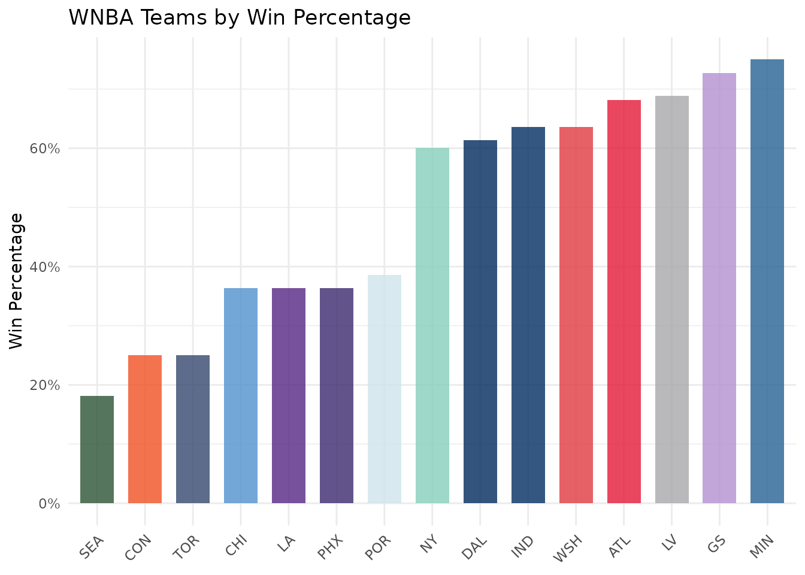
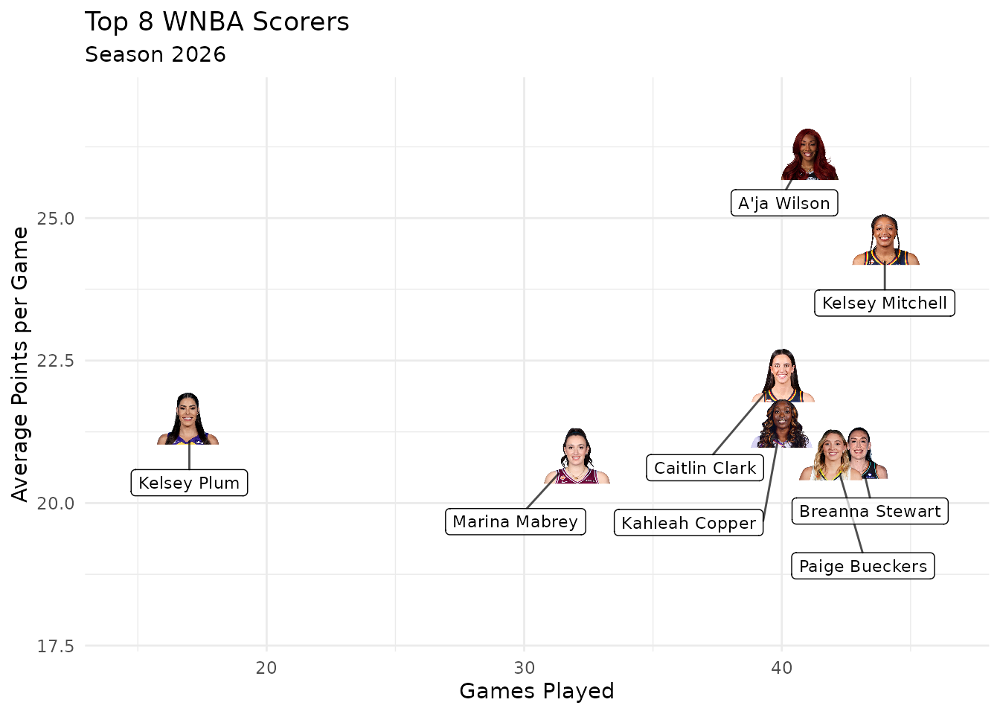
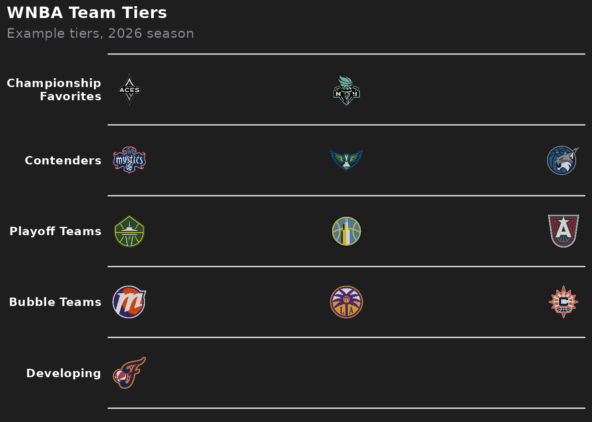
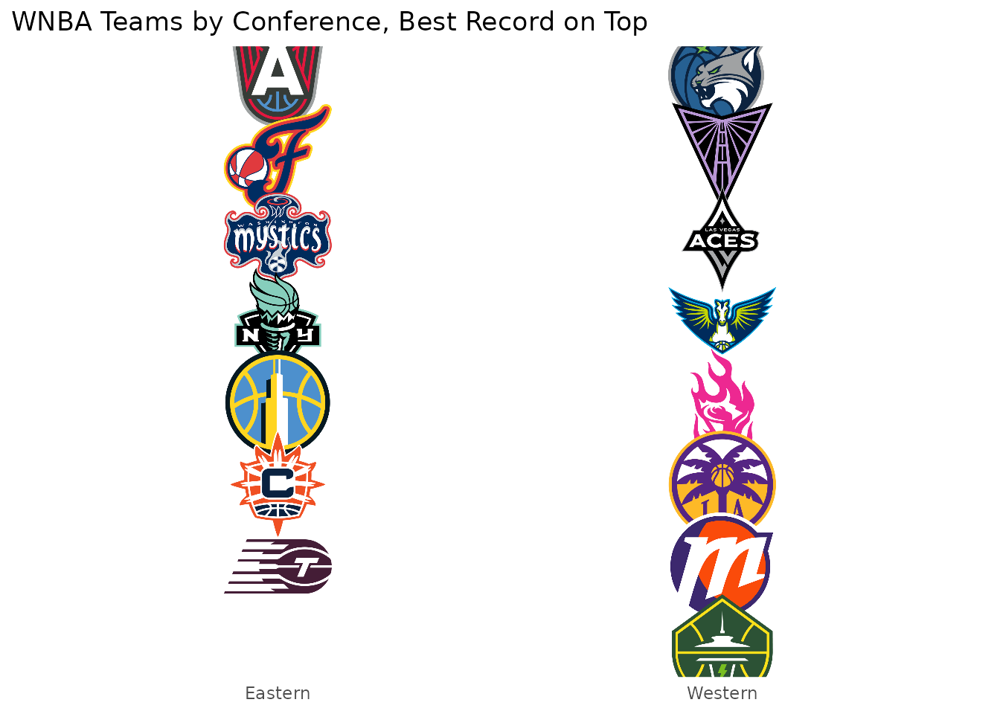
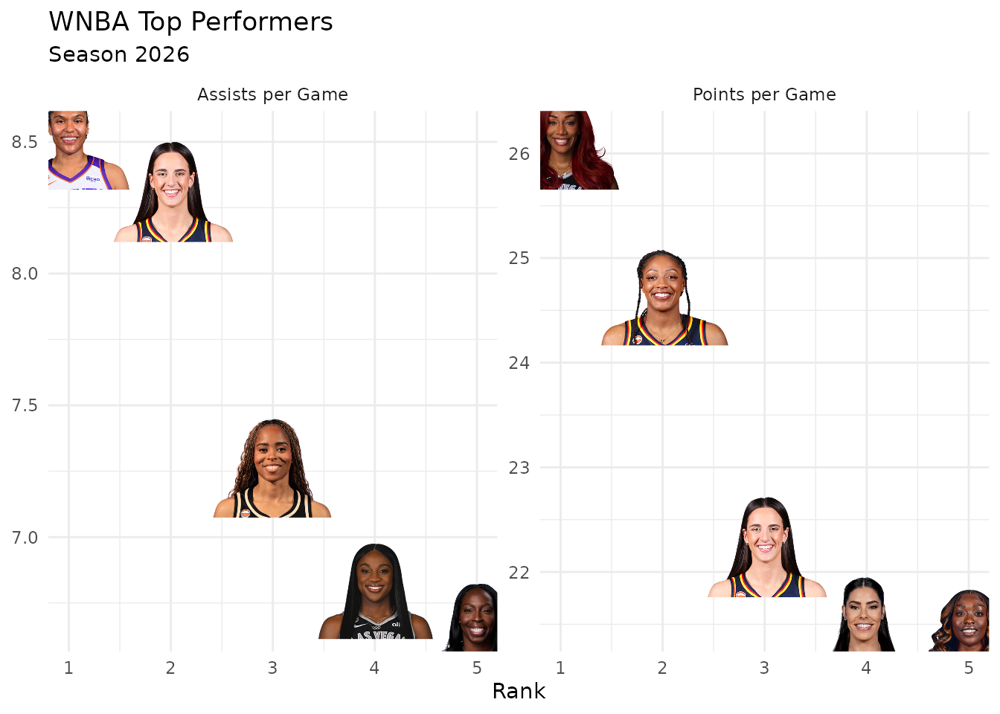
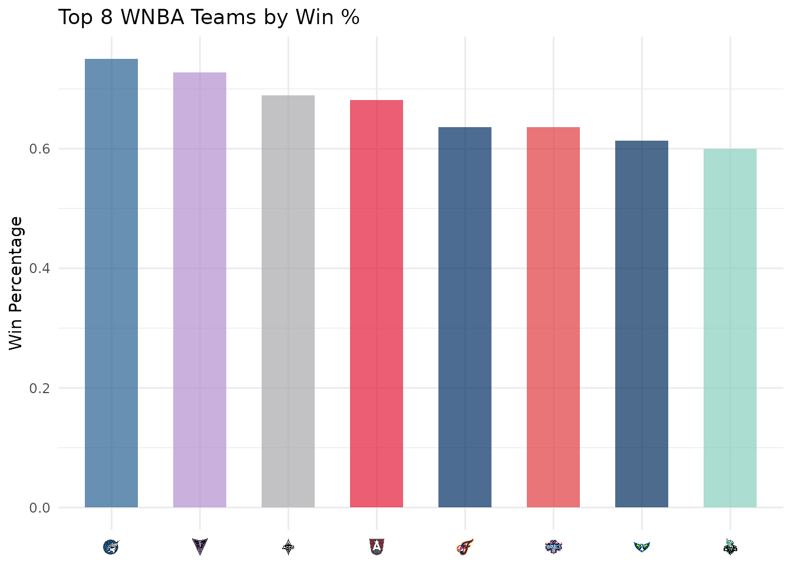

# WNBA Visualizations with wehoop and sdvplotR

On this page

## Introduction

This vignette demonstrates how to create rich WNBA visualizations by
combining [wehoop](https://wehoop.sportsdataverse.org) for player and
team data with [sdvplotR](https://sdvplotr.sportsdataverse.org) for team
logos, headshots, colors, and gt tables.

## Setup

``` r

library(sdvplotR)
library(ggplot2)
library(wehoop)
library(dplyr)
library(gt)

# Get valid WNBA team abbreviations
wnba_teams <- valid_team_names("wnba")
head(wnba_teams)
#> [1] "ATL" "CHI" "CON" "DAL" "GS"  "IND"
```

## Loading WNBA Data

Use `wehoop` to load this season’s ESPN team and player box scores:

``` r

# The last completed regular season (it ends in mid-September)
season <- as.integer(format(Sys.Date(), "%Y")) -
  (format(Sys.Date(), "%m-%d") < "09-20")

# One row per team per game (ESPN box scores), regular season only. ESPN tags
# the All-Star games as regular season too; keeping the league's own teams
# drops them
league_teams <- team_reference("wnba")$team_abbr
team_stats <- wehoop::load_wnba_team_box(seasons = season) |>
  filter(season_type == 2, team_abbreviation %in% league_teams)

# One row per player per game, with ESPN athlete IDs; players who did not
# play are dropped so games played counts real games
player_stats <- wehoop::load_wnba_player_box(seasons = season) |>
  filter(season_type == 2, !did_not_play, team_abbreviation %in% league_teams)
```

## WNBA Team Performance

Visualize team performance with team logos:

``` r

# Calculate team metrics
team_perf <- team_stats |>
  filter(!is.na(team_abbreviation)) |>
  group_by(team_abbreviation) |>
  summarise(
    avg_points = mean(team_score, na.rm = TRUE),
    avg_rebounds = mean(total_rebounds, na.rm = TRUE),
    games = n(),
    .groups = "drop"
  ) |>
  filter(games >= 10)

ggplot(team_perf, aes(x = avg_points, y = avg_rebounds)) +
  geom_sdv_logos(
    aes(team = team_abbreviation),
    sport = "wnba",
    width = 0.075
  ) +
  labs(
    title = "WNBA Team Performance",
    subtitle = paste("Season", season),
    x = "Average Points per Game",
    y = "Average Rebounds per Game",
    caption = "Data: wehoop | Viz: sdvplotR"
  ) +
  theme_minimal()
```


## WNBA Team Colors

Use team colors to visualize win percentages:

``` r

# Calculate win percentage
team_wins <- team_stats |>
  filter(!is.na(team_abbreviation)) |>
  group_by(team_abbreviation) |>
  summarise(
    wins = sum(team_winner, na.rm = TRUE),
    games = n(),
    .groups = "drop"
  ) |>
  filter(games >= 10) |>
  mutate(win_pct = wins / games) |>
  arrange(desc(win_pct))

ggplot(team_wins, aes(x = reorder(team_abbreviation, win_pct), y = win_pct)) +
  geom_col(aes(fill = team_abbreviation), width = 0.7) +
  scale_fill_sdv(sport = "wnba", alpha = 0.8) +
  scale_y_continuous(labels = scales::percent) +
  labs(
    title = "WNBA Teams by Win Percentage",
    x = NULL,
    y = "Win Percentage"
  ) +
  theme_minimal() +
  theme(
    axis.text.x = element_text(angle = 45, hjust = 1),
    legend.position = "none"
  )
```



## Player Headshots

Visualize top performers with player headshots:

``` r

# Top scorers
top_scorers <- player_stats |>
  filter(!is.na(athlete_id)) |>
  group_by(athlete_id, athlete_display_name) |>
  summarise(
    avg_points = mean(points, na.rm = TRUE),
    games = n(),
    .groups = "drop"
  ) |>
  filter(games >= 15) |>
  arrange(desc(avg_points)) |>
  head(8)

ggplot(top_scorers, aes(x = games, y = avg_points)) +
  geom_sdv_headshots(
    aes(player_id = athlete_id),
    sport = "wnba",
    height = 0.1
  ) +
  # Labels sit a fixed share of the y range below their face; ggrepel moves
  # the ones that would collide and draws a connector back to the player
  ggrepel::geom_label_repel(
    aes(label = athlete_display_name),
    nudge_y = -0.22 * diff(range(top_scorers$avg_points)),
    size = 3,
    alpha = 0.7,
    box.padding = 0.5,
    point.size = 12,
    min.segment.length = 0,
    seed = 1
  ) +
  scale_x_continuous(expand = expansion(mult = 0.15)) +
  scale_y_continuous(expand = expansion(mult = c(0.35, 0.2))) +
  labs(
    title = "Top 8 WNBA Scorers",
    subtitle = paste("Season", season),
    x = "Games Played",
    y = "Average Points per Game"
  ) +
  theme_minimal()
```



### WNBA Stats player IDs

The headshots above use ESPN athlete IDs, the `athlete_id` in wehoop’s
`load_wnba_*()` data. wehoop’s `wnba_*()` functions read stats.wnba.com,
which numbers players differently (`PLAYER_ID`). Pass
`id_type = "league"` to draw those from the WNBA’s own image CDN. Both
are plain numbers, so without it a WNBA Stats ID is read as an ESPN ID
and draws someone else or nothing.

``` r

leaders <- wehoop::wnba_leagueleaders(season = season)$LeagueLeaders |>
  mutate(across(c(GP, PTS), as.numeric)) |>
  head(8)

ggplot(leaders, aes(x = GP, y = PTS)) +
  geom_sdv_headshots(
    aes(player_id = PLAYER_ID),
    sport = "wnba",
    id_type = "league",
    height = 0.15
  ) +
  labs(title = "WNBA scoring leaders", x = "Games Played", y = "Points")
```

`id_type` works the same in
[`gt_sdv_headshots()`](https://sdvplotR.sportsdataverse.org/reference/gt_sdv_headshots.md),
[`reactable_sdv_headshots()`](https://sdvplotR.sportsdataverse.org/reference/reactable_sdv_images.md),
the headshot axis scales and
[`element_sdv_headshot()`](https://sdvplotR.sportsdataverse.org/reference/element_sdv.md).
The chunk above is not run when this site is built: stats.wnba.com and
the WNBA’s image CDN both refuse requests from datacenter IPs, the build
server’s included, so a plot rendered on CI or a server comes back
without these headshots. Tables are unaffected, because the reader’s
browser loads the images.

## WNBA Team Tiers

Create a tier plot ranking WNBA teams:

``` r

# Example tier assignments (replace with your own rankings)
tier_data <- data.frame(
  tier_no = c(1, 1, 2, 2, 2, 3, 3, 3, 4, 4, 4, 5),
  team = c("LV", "NY", "WAS", "DAL", "MIN",
           "SEA", "CHI", "ATL",
           "PHX", "LA", "CON",
           "IND")
)

sdv_team_tiers(
  tier_data,
  sport = "wnba",
  title = "WNBA Team Tiers",
  subtitle = paste("Example tiers,", season, "season"),
  tier_desc = c(
    "1" = "Championship Favorites",
    "2" = "Contenders",
    "3" = "Playoff Teams",
    "4" = "Bubble Teams",
    "5" = "Developing"
  )
)
```



## WNBA Conference Standings

Visualize teams by conference:

``` r

# Every team's winning percentage, with the conference sdvplotR keeps for it
conference_standings <- team_stats |>
  group_by(team_abbreviation) |>
  summarise(win_pct = mean(team_winner, na.rm = TRUE), .groups = "drop") |>
  mutate(team_abbr = clean_team_abbrs(team_abbreviation, sport = "wnba")) |>
  inner_join(select(team_reference("wnba"), team_abbr, conference), by = "team_abbr") |>
  arrange(conference, desc(win_pct)) |>
  group_by(conference) |>
  mutate(team_rank = row_number()) |>
  ungroup() |>
  mutate(conference_num = as.numeric(factor(conference)))

ggplot(conference_standings, aes(x = conference_num, y = team_rank)) +
  geom_sdv_logos(
    aes(team = team_abbr),
    sport = "wnba",
    width = 0.12
  ) +
  scale_x_continuous(
    breaks = seq_along(levels(factor(conference_standings$conference))),
    labels = levels(factor(conference_standings$conference)),
    expand = expansion(add = 0.6)
  ) +
  scale_y_reverse() +
  labs(
    title = "WNBA Teams by Conference, Best Record on Top",
    x = NULL,
    y = NULL
  ) +
  theme_minimal() +
  theme(
    axis.text.y = element_blank(),
    panel.grid = element_blank()
  )
```



## WNBA Standings Table with Logos

Create a gt table with team logos:

``` r

standings_table <- team_wins |>
  mutate(
    logo = team_abbreviation,
    rank = row_number()
  ) |>
  select(rank, logo, team_abbreviation, wins, games, win_pct)

standings_table |>
  gt() |>
  gt_sdv_logos(columns = "logo", sport = "wnba", height = 35) |>
  fmt_number(columns = "win_pct", decimals = 3) |>
  cols_label(
    rank = "#",
    logo = "Team",
    team_abbreviation = "Abbrev",
    wins = "Wins",
    games = "Games",
    win_pct = "Win %"
  ) |>
  tab_header(
    title = "WNBA Standings",
    subtitle = paste("Season", season)
  )
```

| WNBA Standings |  |  |  |  |  |
|----|----|----|----|----|----|
| Season 2026 |  |  |  |  |  |
| \# | Team | Abbrev | Wins | Games | Win % |
| 1 |  | MIN | 33 | 44 | 0.750 |
| 2 |  | GS | 32 | 44 | 0.727 |
| 3 |  | LV | 31 | 45 | 0.689 |
| 4 |  | ATL | 30 | 44 | 0.682 |
| 5 |  | IND | 28 | 44 | 0.636 |
| 6 |  | WSH | 28 | 44 | 0.636 |
| 7 |  | DAL | 27 | 44 | 0.614 |
| 8 |  | NY | 27 | 45 | 0.600 |
| 9 |  | POR | 17 | 44 | 0.386 |
| 10 |  | CHI | 16 | 44 | 0.364 |
| 11 |  | LA | 16 | 44 | 0.364 |
| 12 |  | PHX | 16 | 44 | 0.364 |
| 13 |  | CON | 11 | 44 | 0.250 |
| 14 |  | TOR | 11 | 44 | 0.250 |
| 15 |  | SEA | 8 | 44 | 0.182 |

## Player Performance Comparison

Compare the scoring leaders with the assist leaders:

``` r

per_game <- player_stats |>
  group_by(athlete_id, athlete_display_name) |>
  summarise(
    points = mean(points, na.rm = TRUE),
    assists = mean(assists, na.rm = TRUE),
    games = n(),
    .groups = "drop"
  ) |>
  filter(games >= 15)

comparison <- bind_rows(
  per_game |>
    slice_max(points, n = 5, with_ties = FALSE) |>
    transmute(athlete_id, category = "Points per Game", value = points),
  per_game |>
    slice_max(assists, n = 5, with_ties = FALSE) |>
    transmute(athlete_id, category = "Assists per Game", value = assists)
) |>
  group_by(category) |>
  mutate(rank = row_number()) |>
  ungroup()

ggplot(comparison, aes(x = rank, y = value)) +
  geom_sdv_headshots(
    aes(player_id = athlete_id),
    sport = "wnba",
    height = 0.2
  ) +
  facet_wrap(~category, scales = "free_y") +
  scale_x_continuous(breaks = 1:5) +
  labs(
    title = "WNBA Top Performers",
    subtitle = paste("Season", season),
    x = "Rank",
    y = NULL
  ) +
  theme_minimal()
```



## Axis Labels with Logos

Replace axis labels with team logos:

``` r

top_8 <- team_wins |>
  head(8) |>
  mutate(team_abbreviation = factor(team_abbreviation, levels = team_abbreviation))

ggplot(top_8, aes(x = team_abbreviation, y = win_pct)) +
  geom_col(aes(fill = team_abbreviation), width = 0.6) +
  scale_fill_sdv(sport = "wnba", alpha = 0.7) +
  scale_x_sdv(sport = "wnba") +
  theme_minimal() +
  theme_x_sdv() +
  labs(
    title = "Top 8 WNBA Teams by Win %",
    x = NULL,
    y = "Win Percentage"
  ) +
  theme(legend.position = "none")
```



## Next Steps

- Explore [wehoop documentation](https://wehoop.sportsdataverse.org/)
- Try combining with [oddsapiR](https://oddsapiR.sportsdataverse.org)
  for betting lines
- Build weekly dashboard with [Quarto](https://quarto.org/)

## Related Vignettes

- [Getting
  Started](https://sdvplotR.sportsdataverse.org/articles/getting-started.md)
- [Social Posting
  Patterns](https://sdvplotR.sportsdataverse.org/articles/social-posting.md)
- [Leaderboard
  Dashboards](https://sdvplotR.sportsdataverse.org/articles/leaderboard-dashboards.md)
