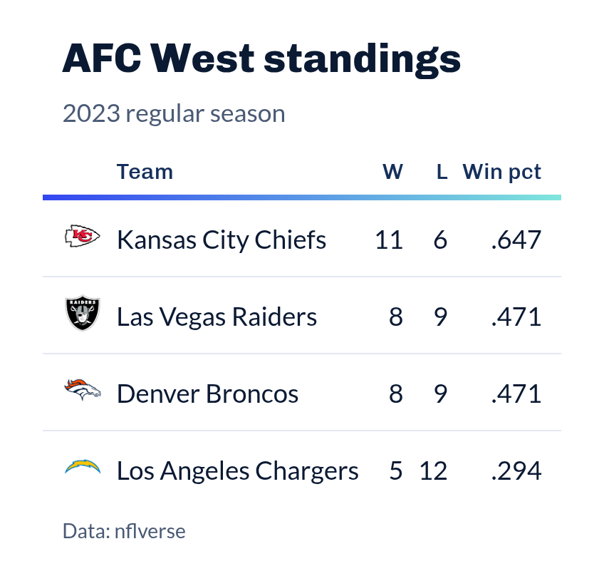
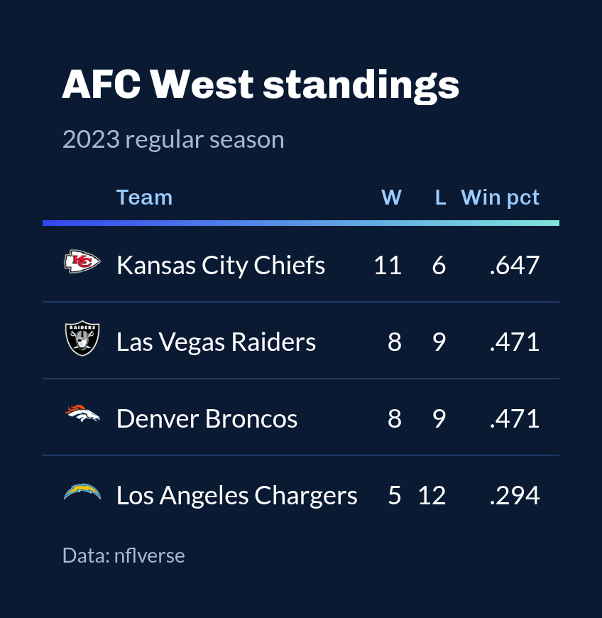

# SportsDataverse theme for `gt` tables

The SportsDataverse house table: Chivo titles and column labels, a Lato
body set in tabular figures, faint row dividers, and the SDV gradient
(`#3346F0` to `#7FE6DC`) drawn as a single horizon line under the column
labels. `style = "dark"` sets the same table on the SportsDataverse
navy, matching the dark mode of the package websites.

## Usage

``` r
gt_theme_sdv(
  gt_object,
  style = c("light", "dark"),
  density = c("comfortable", "compact", "social"),
  ...
)
```

## Arguments

- gt_object:

  A `gt` table object to modify.

- style:

  Character. `"light"` for a white table, or `"dark"` for the
  SportsDataverse navy. Defaults to `"light"`.

- density:

  Character. The type and padding scale. One of `"comfortable"`,
  `"compact"`, or `"social"`. See Density. Defaults to `"comfortable"`.

- ...:

  Additional arguments passed to
  [`gt::tab_options`](https://gt.rstudio.com/reference/tab_options.html),
  applied last so they override anything the theme sets.

## Value

Returns a modified `gt` table with the theme applied.

## Details

The gradient line is the theme's one accent; everything else stays quiet
so logos from
[`gt_sdv_logos()`](https://sdvplotR.sportsdataverse.org/reference/gt_sdv_logos.md)
and team colors carry the table. Titles and the heading are
left-aligned. Column labels keep the case you give them rather than
being forced to capitals. For a table dressed in one team's colors, see
[`gt_theme_sdv_team()`](https://sdvplotR.sportsdataverse.org/reference/gt_theme_sdv_team.md).

The line under the column labels is a CSS `::after` element. gt's CSS
inliner removes those, so `gt::as_raw_html(inline_css = TRUE)` output
(as used for email) shows the table without it; knitted documents,
websites and images saved with
[`gt_save_crop()`](https://sdvplotR.sportsdataverse.org/reference/gt_save_crop.md)
keep it.

## Density

`density` scales the theme's type and row padding together.
`"comfortable"` leaves every size as the theme sets it, `"compact"`
scales both down, and `"social"` scales both up, to the scale
[`gt_save_crop()`](https://sdvplotR.sportsdataverse.org/reference/gt_save_crop.md)
and
[`gt_social_crop()`](https://sdvplotR.sportsdataverse.org/reference/gt_social_crop.md)
export at.

## Figures





## See also

[`gt_theme_sdv_team()`](https://sdvplotR.sportsdataverse.org/reference/gt_theme_sdv_team.md),
[theme_bg](https://sdvplotR.sportsdataverse.org/reference/theme_bg.md)
for the background to pad a saved image with.

## Examples

``` r
library(gt)
standings <- data.frame(
  team = c("KC", "LAC", "DEN", "LV"),
  w = c(15, 11, 10, 4), l = c(2, 6, 7, 13)
)
gt(standings) |>
  gt_sdv_logos(columns = "team", sport = "nfl") |>
  tab_header("AFC West standings", "Through week 18") |>
  gt_theme_sdv()


  


AFC West standings
```
