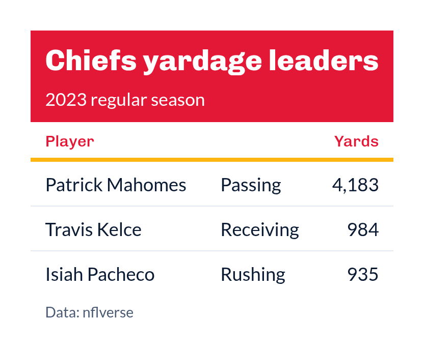

# Team-colored SportsDataverse theme for `gt` tables

[`gt_theme_sdv()`](https://sdvplotR.sportsdataverse.org/reference/gt_theme_sdv.md)
dressed in one team's colors: the title block is filled with the team's
primary color, the horizon line under the column labels takes the
secondary color, and the column labels are set in the primary color. The
colors come from
[`sdv_team_colors()`](https://sdvplotR.sportsdataverse.org/reference/sdv_team_colors.md),
so any abbreviation, alias or name
[`clean_team_abbrs()`](https://sdvplotR.sportsdataverse.org/reference/clean_team_abbrs.md)
resolves works here.

## Usage

``` r
gt_theme_sdv_team(
  gt_object,
  team = NULL,
  sport = c("nfl", "nba", "wnba", "mlb", "nhl", "cfb", "mbb", "wbb"),
  density = c("comfortable", "compact", "social"),
  ...
)
```

## Arguments

- gt_object:

  A `gt` table object to modify.

- team:

  Character. One team, as an abbreviation, alias or name for `sport`.
  Defaults to `NULL`, which uses the SportsDataverse colors.

- sport:

  Character. The league `team` belongs to; see
  [`supported_sports()`](https://sdvplotR.sportsdataverse.org/reference/supported_sports.md).
  Defaults to `"nfl"`.

- density:

  Character. The type and padding scale. One of `"comfortable"`,
  `"compact"`, or `"social"`. See Density. Defaults to `"comfortable"`.

- ...:

  Additional arguments passed to
  [`gt::tab_options`](https://gt.rstudio.com/reference/tab_options.html),
  applied last so they override anything the theme sets.

## Value

Returns a modified `gt` table with the theme applied.

## Details

Text on the filled title block is black or white, whichever contrasts
more with the team's primary color, and the subtitle is blended toward
it until it still clears a 4.5:1 contrast ratio. When the secondary
color would vanish against the white table (a white or pale secondary),
the horizon line uses the primary color instead, and column labels fall
back to the SportsDataverse navy when the primary color is too light to
read on white. With `team = NULL` the table wears the SportsDataverse
navy and cyan.

## Figures



## Density

`density` scales the theme's type and row padding together.
`"comfortable"` leaves every size as the theme sets it, `"compact"`
scales both down, and `"social"` scales both up, to the scale
[`gt_save_crop()`](https://sdvplotR.sportsdataverse.org/reference/gt_save_crop.md)
and
[`gt_social_crop()`](https://sdvplotR.sportsdataverse.org/reference/gt_social_crop.md)
export at.

## See also

[`gt_theme_sdv()`](https://sdvplotR.sportsdataverse.org/reference/gt_theme_sdv.md),
[`sdv_team_colors()`](https://sdvplotR.sportsdataverse.org/reference/sdv_team_colors.md).

## Examples

``` r
library(gt)
leaders <- data.frame(
  player = c("Patrick Mahomes", "Travis Kelce", "Isiah Pacheco"),
  yards = c(4183, 984, 935)
)
gt(leaders) |>
  tab_header("Chiefs yardage leaders", "2023 regular season") |>
  gt_theme_sdv_team(team = "KC", sport = "nfl")


  


Chiefs yardage leaders
```
