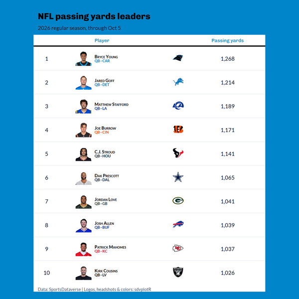
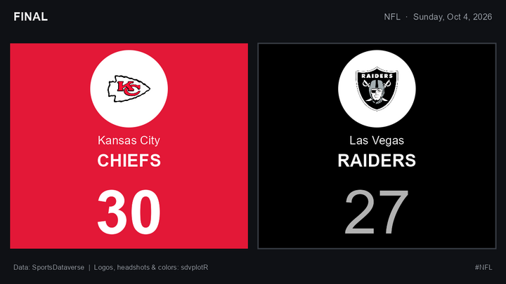
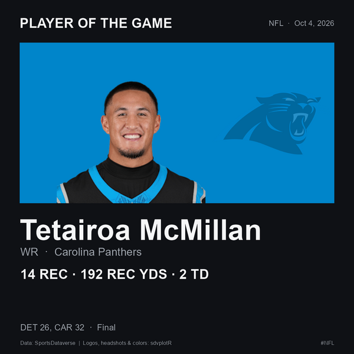

```{r, include = FALSE}
knitr::opts_chunk$set(collapse = TRUE, comment = "#>", message = FALSE)
```

`examples/automation/sdvplotR_social.R` is a complete, scheduled social-media
workflow built on sdvplotR. One script makes season leaderboards and game-day
graphics, writes alt text and captions for them, and posts them to Bluesky. A
GitHub Actions template runs it every week. It covers the NFL, the NBA, the
WNBA, MLB and the NHL. The data comes from the SportsDataverse release files
([nflreadr](https://nflreadr.nflverse.com),
[hoopR](https://hoopR.sportsdataverse.org),
[wehoop](https://wehoop.sportsdataverse.org),
[fastRhockey](https://fastRhockey.sportsdataverse.org)) and the MLB Stats API
([baseballr](https://BillPetti.github.io/baseballr/)), so nothing needs an API
key.

The script is base R plus sdvplotR, the data packages, httr2 and jsonlite. It
lives outside the package, so copy it into your own repository and change it.

## What it makes

**A leaderboard** (`leaderboard`) is a gt table of a season's leaders in one
stat. Each row has the player's headshot (`gt_sdv_headshots()`), team logo
(`gt_sdv_logos()`) and a team-colored subtitle (`gt_merge_stack_team_color()`).
The table is dressed in the leading player's team colors (`gt_theme_sdv_team()`)
and saved at a social size with `gt_social_crop()`: 1080 x 1080, or 1200 x 675
with `--size landscape`.

```{r leaderboard-image, echo = FALSE, out.width = "60%", fig.alt = "The NFL passing yards leaders through October 5, 2026 as a table on Carolina Panthers blue: ten quarterbacks, each with a headshot, the team logo and the yards, Bryce Young first with 1,268."}

```

**Final-score cards** (`gameday`) are ggplot2 images, 1200 x 675, one per game.
Each team sits on its own color (`sdv_team_colors()`), with its logo
(`geom_sdv_logos()`) on a white disc so a logo drawn in the team's own color
still shows. The score is printed in black or white, whichever reads better on
that color, and the winner's score is bold (after a tie, neither is).

```{r score-card-image, echo = FALSE, out.width = "80%", fig.alt = "A final-score card for October 4, 2026: Kansas City Chiefs 30 on red, Las Vegas Raiders 27 on black, each with its logo on a white disc."}

```

**A player-of-the-game card** (also `gameday`), 1080 x 1080, shows the day's
best performance by a player on a team that did not lose, across all of the
day's finals (not only the games that get a card). It has the headshot
(`geom_sdv_headshots()`) on the team's color, the stat line and the result.

```{r potg-image, echo = FALSE, out.width = "60%", fig.alt = "A player-of-the-game card: Tetairoa McMillan's headshot on Carolina Panthers blue, with his line of 14 catches, 192 receiving yards and 2 touchdowns, and the final, Detroit 26, Carolina 32."}

```

The images above are real output of a run on October 5, 2026, scaled down for
this page. Every image carries a source credit.

"Best performance" is a simple rule per sport, and you can change it in
`fetch_box()`:

| Sport | Rule |
|---|---|
| Football | Standard fantasy points, as nflverse computes them |
| Basketball | John Hollinger's game score |
| Hockey | A simplified Dom Luszczyszyn game score for skaters: goals, assists, shots and blocks |
| Baseball | none: MLB box scores have no release file, so MLB posts the score cards only |

### Offseason-safe

Neither command fails because a league is between seasons:

- `gameday` uses the most recent date with finished games when the requested
  date has none, moving to the season before when the new one has not started.
- `leaderboard` uses the latest season that has regular-season leaders.

Both say what they substituted in the caption, for example "No 2026-27
regular-season leaders yet, so these are 2025-26."

## Run it locally

From a clone of sdvplotR, with sdvplotR installed:

```sh
Rscript -e 'install.packages(c("nflreadr", "hoopR", "wehoop", "fastRhockey", "baseballr", "httr2", "jsonlite", "webshot2"))'
Rscript examples/automation/sdvplotR_social.R leaderboard --league nfl
Rscript examples/automation/sdvplotR_social.R leaderboard --league nba --stat assists --size landscape
Rscript examples/automation/sdvplotR_social.R gameday --league nfl --date 2026-10-04
Rscript examples/automation/sdvplotR_social.R post
```

The leaderboard renders in headless Chrome (webshot2, as `gt_save_crop()` does),
so Chrome or Chromium must be installed. The game-day cards need only ggplot2.

Each command writes its PNGs to `out/<today>/` and adds its posts to
`out/<today>/manifest.json`. A re-run replaces its own posts and keeps the
others. `post` reads the newest `out/<date>/manifest.json` unless you pass
`--manifest`:

```json
{
  "version": 1,
  "date": "2026-10-05",
  "posts": [
    {
      "key": "nfl-gameday-2026-10-04-1",
      "fresh": true,
      "thread": "nfl-20261004",
      "league": "nfl",
      "kind": "gameday",
      "caption": "NFL final scores, Sunday, Oct 4, 2026. Player of the game: Tetairoa McMillan, ...",
      "hashtags": ["NFL", "sdvplotR"],
      "images": [
        {"path": "nfl-20261004-player-of-the-game.png", "width": 1080, "height": 1080,
         "alt": "Player of the game card with a headshot: Tetairoa McMillan, WR, ..."}
      ]
    }
  ]
}
```

A Bluesky post holds at most four images. A slate with more games becomes a
thread: the first post carries the player card and three score cards, and each
later post carries four more cards and replies to the first.

Each post has a `key` (league, kind, and the game date or the season) and a
`fresh` flag. A game-day post is fresh when its games are from the requested
date, not an offseason stand-in. A leaderboard is fresh while its season is under
way, so its data runs through today; a finished season's table is stale.

| Option | Command | Meaning |
|---|---|---|
| `--league` | `leaderboard`, `gameday` | `nfl`, `nba`, `wnba`, `mlb` or `nhl` |
| `--season` | `leaderboard` | the season (the year it ends, for the NBA and NHL); default: the current one |
| `--stat` | `leaderboard` | NFL: a column of `nflreadr::load_player_stats()`, such as `rushing_yards`; NBA and WNBA: `points`, `rebounds`, `assists`, `steals`, `blocks` or `three_point_field_goals_made` (per game); NHL: `points`, `goals`, `assists`, `shots_on_goal`, `hits` or `blocked_shots`; MLB: a Stats API leader category such as `homeRuns`, or `pitching.strikeouts` for a pitching one |
| `--top` | `leaderboard` | rows: default 10 square, 5 landscape |
| `--size` | `leaderboard` | `square` (1080 x 1080) or `landscape` (1200 x 675) |
| `--date` | `gameday` | `YYYY-MM-DD`; default yesterday |
| `--max-games` | `gameday` | score cards to draw; default 8 |
| `--out` | all | the output root; default `out` |
| `--manifest` | `post` | the manifest to post; default the newest under `--out` |
| `--post` | `post` | really post (otherwise a dry-run) |
| `--include-stale` | `post` | post stale posts too |
| `--ledger` | `post` | the posted-ledger; default `<out>/posted.json` |

## Post to Bluesky

`post` is a dry-run unless you pass `--post`. It checks every post the way
Bluesky would: one to four images, alt text on each, and text of at most 300
graphemes. A long caption is shortened and keeps its hashtags. Then it prints
each post's text, images and alt text, and whether it would be posted or
skipped. The script's pieces can be used on their own: `source()` it and it only
defines functions. Here is the text a long caption becomes, and the facets that
make its hashtags links, as UTF-8 byte offsets:

```{r post-text}
social <- new.env()
sys.source("../examples/automation/sdvplotR_social.R", envir = social)

post <- list(
  caption = paste(
    "NFL final scores, Sunday, Oct 4, 2026. Player of the game: Tetairoa McMillan,",
    strrep("a very long stat line, ", 12)
  ),
  hashtags = list("NFL", "sdvplotR")
)
text <- social$post_text(post)
social$graphemes(text)
cat(text)
str(lapply(social$hashtag_facets(text), function(f) f$index))
```

Two rules keep a schedule from repeating itself:

- **Only fresh posts go out.** Stale ones (an offseason stand-in date, a finished
  season's leaders) are skipped unless you pass `--include-stale`. From
  February to August, a weekly NFL run makes the Super Bowl card but does not
  post it again each week.
- **Nothing is posted twice.** `post` keeps a ledger, `out/posted.json`, beside
  the dated folders. Each post's key is recorded as soon as the post is made, so
  a re-run skips it. A thread that failed partway resumes where it stopped,
  replying to the posts already made.

To post for real:

1. In Bluesky, open **Settings > Privacy and security > App passwords** and
   create an app password. Never use your account password.
2. Set the handle and app password, then post:

   ```sh
   export BSKY_HANDLE=yourname.bsky.social
   export BSKY_APP_PASSWORD=xxxx-xxxx-xxxx-xxxx
   Rscript examples/automation/sdvplotR_social.R post --post
   ```

The script makes three AT Protocol calls with httr2:

1. `com.atproto.server.createSession` logs in.
2. `com.atproto.repo.uploadBlob` uploads each image. A PNG over Bluesky's
   1,000,000-byte limit is sent as a JPEG.
3. `com.atproto.repo.createRecord` creates the post, with each image's alt text
   and aspect ratio and with the hashtags as tag facets.

If Bluesky answers 429 (rate limited), the script waits until the reset time it
gives, at most a minute, and tries again, up to four attempts in all. Logging in
and uploading also retry a 5xx answer or a dropped connection. Creating the post
is never retried after such a failure, because the post may exist: its ledger
entry stays `pending`, and later runs skip it until you check the account and
delete the entry. Errors name the call and Bluesky's error, never the
credentials. Set `BSKY_SERVICE` to post through another PDS; unset or empty
means `https://bsky.social`.

## Schedule it with GitHub Actions

`examples/automation/workflows/sdvplotR-social.yml` is a template for your own
repository:

1. Copy `sdvplotR_social.R` to `scripts/sdvplotR_social.R` in your repository.
2. Copy the template to `.github/workflows/sdvplotR-social.yml`.
3. Add the repository secrets `BSKY_HANDLE` and `BSKY_APP_PASSWORD`
   (**Settings > Secrets and variables > Actions**).

Every Monday, and whenever you run it by hand, the workflow installs R,
sdvplotR and the data packages (`r-lib/actions/setup-r` and
`setup-r-dependencies`), makes the graphics, prints the would-be posts and
uploads `out/` as an artifact. It has read-only repository permissions and posts
only when both of these hold:

- you start a run by hand with **post** checked, or set the repository variable
  `SDVPLOTR_POST` to `true` to post on the schedule;
- both secrets are set.

To post through another PDS, set the repository variable `BSKY_SERVICE`.

The posted-ledger is kept between runs with `actions/cache`: each run restores
the newest copy and saves its own. GitHub drops a cache that goes unused for 7
days, so a weekly schedule can lose it. That is harmless, because fresh posts
are dated and each week's are new. The ledger guards against re-runs and second
runs on the same day.

`ubuntu-latest` ships Chrome, so the leaderboard tables render there with no
setup.

sdvplotR runs the same script in its own CI each week
(`.github/workflows/automation-example.yaml`) in dry-run mode, so the example
keeps working. That workflow has no secrets and never passes `--post`, and the
script also refuses `--post` in sdvplotR's own GitHub Actions.

## Adapt it

- **Other stats.** Pass `--stat`; a stat the NFL's player stats do not have
  prints the columns they do have.
- **Other leagues.** Add an entry to `LEAGUES` (its hashtag, a default stat,
  its calendar), a branch to `leader_rows()` and `finals()` that loads its
  release data, and a rule to `fetch_box()` for the player card. College
  leagues would need per-player season totals, which their release files do not
  carry yet.
- **Your look.** The layouts are short functions (`score_card()`,
  `potg_card()`, `leaderboard_image()`). Swap `gt_theme_sdv_team()` for another
  `gt_theme_*()` (see [SportsDataverse Table Themes](sdv-table-themes.html)),
  or change the colors at the top of the script.
- **Other networks.** `post` reads only `manifest.json`, so another network is
  one more client beside `bluesky()`. For Mastodon, upload each image to
  `/api/v2/media` with its `description` (the alt text), then create a status
  with `/api/v1/statuses`, passing `media_ids` and `in_reply_to_id` for a
  thread.

## Related

- [Social Posting](social-posting.html) covers sizes and layouts for posting by
  hand.
- [Saving and Posting Tables](saving_tables.html) covers `gt_save_crop()` and
  `gt_social_crop()`.
- The [NFL weekly](leaderboard-nfl-weekly.html) and other leaderboards rebuild
  with this site every week.
